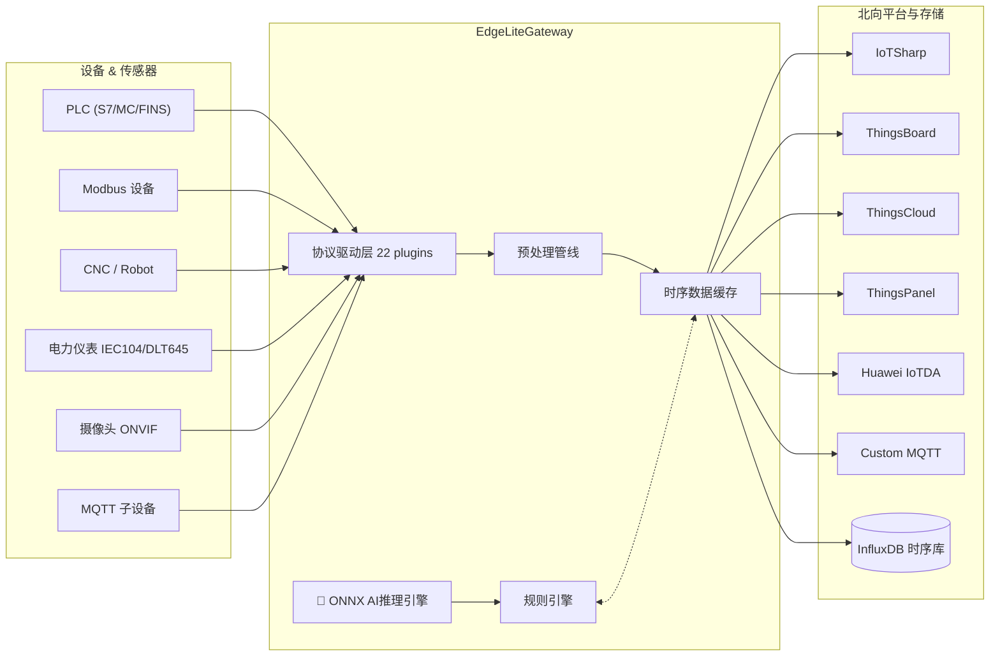
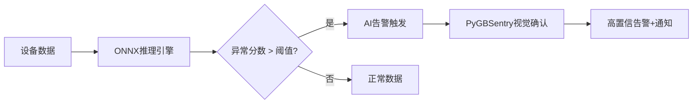

<div align="center">

# ⚡ EdgeLiteGateway

### 开源轻量级边缘AI网关 —— 让设备接入像插U盘一样简单，让边缘节点会"思考"

[](LICENSE)
[](https://www.python.org/)
[](https://fastapi.tiangolo.com/)
[](https://vuejs.org/)
[](https://github.com/suoten/EdgeLiteGateway)
[](https://www.docker.com/)
[](https://onnxruntime.ai/)

**🧠 国内首个开源边缘AI网关 | 🎯 22种工业协议+AI推理开箱即用 | 📹 传感器AI+视觉AI双确认 | 🪶 轻量Python架构 | 🚀 10分钟Docker部署**

[快速开始](#-快速开始) · [在线演示](https://edgelite.jjtt.net/) · [AI功能](#-边缘ai推理引擎) · [功能特性](#-功能特性) · [安装部署](#-安装部署) · [技术架构](#-技术架构) · [版本对比](#-版本与路线图) · [技术支持](#-技术支持)

**[English](README_EN.md)**

</div>

***

## 🚀 快速开始

> 🎯 **不想部署？先体验演示站点**：[https://edgelite.jjtt.net/](https://edgelite.jjtt.net/)　用户名 `admin` / 密码 `Edgelite123`

> **只需安装 [Docker](https://docs.docker.com/get-docker/)，无需 Node.js / Python**

> ⚠️ **Windows 用户**：请使用 **PowerShell**（不要用 CMD），右键开始菜单 → Windows PowerShell

```bash
# 1. 克隆仓库
git clone https://gitee.com/suoten/EdgeLiteGateway.git && cd EdgeLiteGateway

# 2. 生成配置文件（Windows PowerShell 用 Copy-Item 替代 cp）
cp docker/.env.example docker/.env

# 3. 构建并启动（首次约 3-5 分钟，之后秒启）
#    中国大陆用户如构建卡住/超时，请在 Docker Desktop 设置中配置镜像加速器
#    Settings → Docker Engine → 添加 "registry-mirrors": ["https://docker.1ms.run"]
cd docker && docker compose build edgelite && docker compose up -d

# 4. 查看启动日志
docker compose logs -f edgelite        # 看到 "Uvicorn running" 即成功，Ctrl+C 退出
```

打开浏览器访问 http://localhost:8080 ，账号 `admin` / 密码 `admin123`（首次登录需修改密码）。

<details>
<summary>📡 断网缓存配置（可选）</summary>

MQTT断网缓存功能默认关闭，启用后断网时消息自动持久化到SQLite，网络恢复按序重传：

1. 登录后进入 **系统管理 → MQTT Server**
2. 开启 **启用断网缓存** 开关
3. 配置参数：
   - **离线数据库路径**：默认 `data/mqtt_offline.db`
   - **最大缓存条数**：默认 10000
   - **最大重试次数**：默认 5
   - **重传间隔(ms)**：默认 5000
4. 点击 **保存** 即可，网络中断时消息自动缓存，恢复后自动重传

</details>

<details>
<summary>⚙️ v1.0.2 新增配置项（点击展开）</summary>

**scheduler 配置段**（`configs/config.yaml`）：

```yaml
scheduler:
  max_concurrent_collects: 50    # 最大并发采集数
  error_rate_threshold: 0.1      # 帧错误率告警阈值（10%）
  watchdog_interval: 10          # 看门狗周期数（超时自动重启Task）
```

**InfluxDB 保留策略**：

```yaml
influxdb:
  retention_days: 30             # 数据保留天数（默认30天）
```

**测点可选字段**（跳变检测 + 范围校验）：

```yaml
# 测点配置中可新增：
jump_threshold: 10.0             # 跳变阈值（超过标记quality=suspect）
min_value: 0.0                   # 最小值（低于标记quality=out_of_range）
max_value: 100.0                 # 最大值（高于标记quality=out_of_range）
```

</details>

<details>
<summary>🖥️ 已安装 Node.js？用混合模式（本地构建前端 + Docker 跑后端）</summary>

如果你本地有 Node.js 18+，可以先构建前端再用 Docker 启动，这样访问 http://localhost:3000 （Nginx 提供前端，速度更快）：

```bash
git clone https://gitee.com/suoten/EdgeLiteGateway.git && cd EdgeLiteGateway
cd web && npm install && npm run build && cd ..
cp docker/.env.example docker/.env
cd docker && docker compose --profile nginx up -d
```

</details>

---

<details>
<summary>🎯 一键部署做了什么？（点击展开）</summary>

| 步骤 | 操作 | 耗时 | 说明 |
|------|------|------|------|
| 1 | 克隆代码 | 几秒 | `git clone` 下载项目 |
| 2 | 生成配置 | 瞬间 | `cp .env.example .env` 创建环境变量 |
| 3 | 构建镜像 | 3-5 分钟 | Docker 内自动安装依赖、构建前后端 |
| 4 | 启动容器 | 30 秒 | `docker compose up -d` 后台启动网关/InfluxDB/MQTT |

</details>

***

## 🛠️ 前提条件（必看）

在部署之前，请确认你的环境满足以下要求。**如果不满足，下面的步骤会报错。**

| 软件                        | 最低版本   | 检查命令               | 安装方法                                                                                                      |
| ------------------------- | ------ | ------------------ | --------------------------------------------------------------------------------------------------------- |
| **Docker**                | 20.10+ | `docker --version` | Windows/Mac: [Docker Desktop](https://docs.docker.com/get-docker/)；Linux: `curl -fsSL https://get.docker.com \| sudo sh` |
| **Git**                   | 2.30+  | `git --version`    | [Git 下载](https://git-scm.com/downloads)                                                                    |
| **Node.js** (仅混合模式需要)     | 18+    | `node --version`   | [Node.js 官网](https://nodejs.org/zh-cn/download/) 下载 LTS 版本                                                 |
| **Python** (仅开发模式需要)       | 3.11+  | `python --version` | [Python 官网](https://www.python.org/downloads/) 下载 3.11 或 3.12                                             |

> **💡 Windows 用户特别注意**：Windows 自带 CMD 不支持 `&&` 连接命令，请使用 **PowerShell**（右键开始菜单 -> Windows PowerShell）或安装 [Git Bash](https://git-scm.com/downloads)。`cp` 命令在 PowerShell 中可用，等同于 `Copy-Item`。

***

## ⚠️ 常见问题速查（撞墙自救指南）

遇到错误不要慌，按下面的对照表处理：

| 报错信息                            | 可能原因          | 解决办法                                                                                           |
| ------------------------------- | ------------- | ---------------------------------------------------------------------------------------------- |
| `docker: command not found`     | 没装 Docker     | 去 Docker 官网下载安装                                                                                |
| `Docker Desktop is not running` | Docker 没启动    | 双击桌面 Docker 图标启动，等鲸鱼图标稳定后再执行命令                                                                 |
| `INFLUXDB_TOKEN is not set`     | 没复制 `.env` 文件 | 执行 `cp docker/.env.example docker/.env`                                                        |
| `node: command not found`       | 没装 Node.js（混合模式才需要） | 改用默认的纯容器模式，无需 Node.js                                                                     |
| `npm ERR! code EACCES`          | 没权限           | Windows 用管理员运行 PowerShell，Linux 加 `sudo`                                                       |
| `port 3000 is already in use`   | 端口被占用         | 关闭占用端口的程序，或修改 `docker/docker-compose.yml` 中的端口                                                 |
| `port 8080 is already in use`   | 后端端口被占用       | 同上，Tomcat/Jenkins 通常占用 8080                                                                    |
| `Error: ENOSPC: System limit`   | Linux 文件监听限制  | 执行 `echo fs.inotify.max_user_watches=524288 \| sudo tee -a /etc/sysctl.conf && sudo sysctl -p` |
| 页面打开白屏/一直在加载                    | 前端没构建或其他原因   | **[→ 看这里，分步诊断](#-页面打不开怎么办逐步诊断)**                                                    |
| `npm run build` 报内存不足           | Node.js 内存限制  | 执行 `set NODE_OPTIONS=--max-old-space-size=4096 && npm run build`                               |
| 登录时提示"用户名或密码错误"                 | 忘了密码          | 首次启动查看日志获取临时密码，如修改过请删除 `data/edgelite.db` 重新启动                                              |

> 如果上面没有你的错误，请去 [GitHub Issues](https://github.com/suoten/EdgeLiteGateway/issues) 搜索或提交新问题。

---

### 🔍 页面打不开怎么办？（逐步诊断）

这是最常见的求助问题。**不要慌，按下面顺序一条条跑，每一步都会告诉你问题出在哪里。**

> **💡 Windows PowerShell 用户注意**：下面命令中的 `ls` 换成 `dir`，`curl` 换成 `curl.exe`，其他不变。以下命令均从**项目根目录**执行。

```bash
# 诊断 1：Docker 容器在不在？
cd docker && docker compose ps
```
> ✅ 正常：3 个容器（edgelite / influxdb / mosquitto）状态全是 `Up` 或 `healthy`
> ❌ 异常有容器 `Exited` → 执行 `docker compose logs <容器名>` 看错误日志

```bash
# 诊断 2：后端是否在运行？
curl http://localhost:8080/health
```
> ✅ 正常：返回 `{"status":"ok"}`
> ❌ 无响应 → 后端容器挂了，执行 `docker compose logs edgelite --tail 30` 看崩溃原因

```bash
# 诊断 3：InfluxDB 是否健康？
curl http://localhost:8086/health
```
> ✅ 正常：返回 `{"status":"pass"}`
> ❌ → 等 30 秒再试，或 `docker compose restart influxdb`

**以上 3 步全部通过后**，浏览器打开 `http://localhost:8080`，用 `admin` / `admin123` 登录。

> 💡 **还不行？** 终极重装法（注意这会**清空所有数据**）：
>
> **Linux / Mac：**
> ```bash
> cd docker && docker compose down -v && rm -rf ../data/ && cp .env.example .env && docker compose build edgelite && docker compose up -d
> ```
> **Windows PowerShell：**
> ```powershell
> cd docker; docker compose down -v; Remove-Item -Recurse -Force ../data/; Copy-Item .env.example .env; docker compose build edgelite; docker compose up -d
> ```

***

## 🎯 什么时候需要 EdgeLite？

> **边缘AI异常检测**：你希望网关不只采集数据，还能在边缘侧用AI模型实时检测异常、预测趋势，数据不出厂，延迟低于100ms，而不是把所有数据传到云端再分析。

> **传感器+视觉双确认**：你的产线需要传感器AI+视觉AI双确认——温度传感器异常后自动调取摄像头画面，视觉AI确认是否真的冒烟，而不是只靠单一数据源告警频繁误报。

> **工厂设备采集**：你的车间里跑着西门子、三菱、Modbus 等各种协议的设备，你希望一个网关统一采集、阈值超限自动告警、数据直接上报 MES，而不是每个协议写一套采集程序。

> **园区能源 + 视频联动**：你需要把电表水表数据和 GB28181 摄像头画面接到同一个平台，在 3D 可视化大屏上实时看能耗和监控，而不是能源系统和视频系统各搞一套。

> **远程串口运维**：你需要远程调试现场的串口设备（PLC、仪表），但不想给每个现场部署 VPN，通过 EdgeLite 的串口透传功能就能直接访问。

***

## 📋 功能特性

### 设备接入 / 协议适配

| 类别 | 协议 | 说明 |
|------|------|------|
| **通用工业** | Modbus TCP/RTU | 最广泛使用的工业协议，几乎兼容所有 PLC/传感器 |
| **通用工业** | Siemens S7 (S7-200/300/400/1200/1500) | 西门子 PLC 全系列 |
| **通用工业** | Mitsubishi MC (iQ-R/Q/L/FX) | 三菱 PLC 全系列 |
| **通用工业** | Omron FINS (CJ/CP/NJ) | 欧姆龙 PLC |
| **通用工业** | Allen-Bradley CIP/PCCC | 罗克韦尔 AB PLC |
| **通用工业** | OPC-UA Client | 跨平台工业互操作标准 |
| **通用工业** | OPC-DA Client | 传统 Windows OPC 兼容 |
| **通用工业** | MQTT Client (Sparkplug B) | **Sparkplug B** — MQTT Sparkplug B 工业规范协议，支持工业MQTT数据标准化发布与订阅 |
| **电力/能源** | IEC 60870-5-104 | 电力远动规约，变电站/配电自动化 |
| **电力/能源** | DL/T 645-2007 | 国家电能表通信规约 |
| **机器人/CNC** | ABB RWS (Web Services) | ABB 机器人 REST API |
| **机器人/CNC** | FANUC FOCAS | 发那科 CNC 数控系统 |
| **机器人/CNC** | KUKA Ethernet KRL | 库卡机器人 XML |
| **称重/仪表** | Toledo MT-SICS | 梅特勒-托利多称重仪表 |
| **视频** | ONVIF / PyGBSentry / HTTP | IP 摄像头 / 视频边缘分析（企业版支持） |
| **扩展** | HTTP Webhook / Serial / Simulator | 自定义拉取、串口原始数据、虚拟设备调试 |

<details>
<summary>📡 查看完整通信架构图</summary>



</details>

***

### 🧠 边缘AI推理引擎

> **这是 EdgeLite 与所有传统网关的核心差异——在边缘侧完成AI推理，数据不出厂，延迟<100ms**

- **ONNX Runtime 推理引擎**：原生支持 `.onnx` 模型，边缘侧实时推理，单次延迟 < 100ms
- **8个预置AI模型开箱即用**：异常检测、趋势预测、动态阈值、振动分析、能耗预测、质量检测、电池健康、泄漏检测
- **模型热加载**：不重启网关即可替换模型，运维零中断
- **AI → 规则引擎联动**：AI推理结果直接驱动告警规则，传感器异常 → AI确认 → 自动告警
- **AI推理看板**：实时统计推理次数/延迟/错误率，可视化AI运行状态
- **传感器AI + 视觉AI 双确认**：EdgeLite传感器AI检测异常 → 调用PyGBSentry视觉AI二次确认 → 高置信告警

<details>
<summary>⚙️ 启用AI推理引擎（点击展开）</summary>

AI推理引擎默认启用，但需要安装 ONNX Runtime 依赖：

```bash
# 安装 AI 推理依赖（在虚拟环境中执行）
pip install -e ".[ai]"

# 或安装全部可选依赖
pip install -e ".[all]"
```

Docker 部署时已自动包含 ONNX Runtime，无需额外操作。

如需关闭 AI 引擎，在 `configs/config.yaml` 中设置：

```yaml
ai_inference:
  enabled: false
```

</details>



***

### 边缘计算引擎

- **规则引擎**：阈值告警 / 死区过滤 / 变化检测 / 条件动作（P1）
- **数据预处理**：缩放 / 死区 / 限幅 / 开方 / 累积（P1）
- **告警服务**：`钉钉 / 邮件 (SMTP) / 企业微信 / Webhook` 多渠道通知
- **MQTT断网缓存与自动重传**：断网时消息自动持久化到SQLite，网络恢复后按序重传，确保数据零丢失（P1）
- **RPC反向控制**：支持从北向平台（ThingsBoard/IoTSharp等）下发RPC指令反向控制设备，实现远程调参/启停（P1）
- **Sparkplug B协议**：支持Sparkplug B工业物联网协议，标准化工农业MQTT数据发布与订阅（P1）
- **多网关级联发现**：基于mDNS自动发现邻居网关并构建级联拓扑，支持大规模部署场景的网关互联（P1）
- **边缘AI推理引擎**：ONNX Runtime 推理 / 3预置模型（异常检测/趋势预测/动态阈值）/ 模型热加载 / AI规则联动 / AI推理看板（P2）

### 平台与系统

- **认证鉴权**：JWT (Access + Refresh) + RBAC `admin / operator / viewer`
- **审计日志**：全操作留痕，`设备/规则/告警/登录` 全维度
- **南向**：MQTT Broker (内置 `amqtt`) / Modbus Slave / Serial Bridge（P2）
- **北向**：自定义 MQTT Broker 把 EdgeLite 变成协议转换中台（P2）
- **MCP Server**：Model Context Protocol 把实时数据暴露给 AI Agent（P2）

> 💡 优先级划分：**P0 = v1.0 必需** · **P1 = v1.0 目标** · **P2 = v1.1+**

### 可视化与交互

- **看板**：设备/点位总数、在线率、今日数据量（P0）
- **SCADA 编辑器**：拖拽绑定测点 + 实时数据（P2）
- **数字孪生**：`Three.js 3D` 模型绑定 / 测点映射 / 视角同步（⚠️ 实验性）
- **数据查询**：多维度图表 / 自定义时间范围（P1）
- **PWA 离线**：Service Worker 离线可用 / 推送通知（P2）

### 📸 界面预览

| 仪表盘 | 规则管理 |
| --- | --- |
|  |  |

| 组态编辑器 | 服务管理 |
| --- | --- |
|  |  |

> 截图来自社区版 v1.0.2

***

## 📦 安装部署

三种部署方式分别适合不同场景，**对号入座**：

| 方式                                           | 适合谁                     | 一句话说明                           |
| -------------------------------------------- | ----------------------- | ------------------------------- |
| [Docker 纯容器（推荐）](#-快速开始)                     | 🟢 **新手推荐**             | 只需 Docker，克隆 → 构建镜像 → 浏览器打开    |
| [Docker + 本地前端](#方式一docker-compose-本地前端)     | 🟡 有 Node.js，想要 Nginx 加速 | 本地构建前端，Docker 跑后端               |
| [Python 本地部署](#方式二python-本地部署开发模式)           | 🔵 开发者/二次开发             | 需要 Python 3.11 + Node.js，启动开发服务 |

***

### 方式一：Docker Compose + 本地前端

适用于本地有 Node.js、想要 Nginx 提供前端（访问 http://localhost:3000）的场景。

```bash
# 1. 克隆仓库
git clone https://gitee.com/suoten/EdgeLiteGateway.git && cd EdgeLiteGateway

# 2. 构建前端页面（需要 Node.js 18+）
cd web && npm install && npm run build && cd ..

# 3. 配置环境变量
cp docker/.env.example docker/.env

# 4. 启动全部服务（-d = 后台运行，--profile nginx 启用 Nginx 前端）
cd docker && docker compose --profile nginx up -d

# 5. 查看日志（确认启动成功）
docker compose logs -f edgelite    # 后端日志

# 6. 浏览器打开 http://localhost:3000，账号 admin，密码 admin123（首次登录需修改密码）
```

| 端口     | 服务             | 说明                   |
| ------ | -------------- | -------------------- |
| `3000` | 前端 (Nginx)     | Web UI               |
| `8080` | 后端 (FastAPI)   | REST API + WebSocket |
| `8086` | InfluxDB       | 时序数据库（仅 localhost）   |
| `1883` | Mosquitto MQTT | MQTT Broker          |

**停止服务**：`docker compose down`\
**完全清除（含数据）**：`docker compose down -v`

***

### 方式二：Python 本地部署（开发模式）

适用于二次开发、调试驱动、修改源码。

```bash
# 前置：必须 Python 3.11+ 且 Node.js 18+

# 1. 克隆
git clone https://gitee.com/suoten/EdgeLiteGateway.git && cd EdgeLiteGateway

# 2. 创建 Python 虚拟环境（重要！避免污染系统 Python）
python -m venv .venv

# 3. 激活虚拟环境
.venv\Scripts\activate        # Windows PowerShell
source .venv/bin/activate     # Linux / Mac

# 4. 安装后端依赖
pip install -e ".[dev]"

# 5. 准备配置文件
cp configs/config.example.yaml configs/config.yaml

# 6. 启动后端（新开一个终端）
python main.py --port 8080

# 7. 新终端启动前端开发服务器（新开一个终端）
cd web
cp .env.example .env          # 前端环境变量
npm install
npm run dev                    # Vite dev server, 默认 http://localhost:5173

# 8. 浏览器打开 http://localhost:5173
#    首次登录：admin / admin123
```

> **💡 为什么需要虚拟环境？** 隔离项目依赖，避免和系统Python其他项目冲突。如果你已激活虚拟环境，终端前面会显示 `(.venv)`。

<details>
<summary>📦 可选：安装 InfluxDB 和 Mosquitto（点击展开）</summary>

时序数据和 MQTT 功能需要额外安装：

```bash
# Ubuntu/Debian
sudo apt install influxdb mosquitto

# 或用 Docker 单独启动：
docker run -d --name influxdb -p 8086:8086 influxdb:2.7
docker run -d --name mosquitto -p 1883:1883 eclipse-mosquitto:2
```

不安装也能跑——系统会自动降级为缓存模式。

</details>

***

### 服务管理命令（备忘）

以下命令在 `docker/` 目录下执行：

```bash
# 查看容器状态
docker compose ps

# 查看所有日志
docker compose logs -f

# 重启网关
docker compose restart edgelite

# 删除所有数据（慎用！不可恢复）
docker compose down -v
rm -rf ../data/ ../logs/
```

***

## 🏛️ 技术架构

```

┌──────────────────────────────────────────────────────────┐
│                      北向平台对接                          │
│  ThingsBoard  IoTSharp  ThingsCloud  ThingsPanel          │
│  Huawei IoTDA  Custom MQTT  ↑ MQTT/HTTP/REST              │
├──────────────────────────────────────────────────────────┤
│                    核心引擎 (EventBus)                     │
│  ┌─────────────────┐  ┌──────────────────┐                │
│  │  MQTT Forwarder │  │   规则引擎        │                │
│  │  预处理管线      │  │  告警/通知服务    │                │
│  └─────────────────┘  └──────────────────┘                │
├──────────────────────────────────────────────────────────┤
│                     数据抽象层 (SOR)                       │
│  ┌──────────────────────────────────────────────┐        │
│  │   SQLite ORM  │  InfluxDB 2.x Client       │        │
│  │   离线Cache   │  Tags: device,tenant,asset  │        │
│  └──────────────────────────────────────────────┘        │
├──────────────────────────────────────────────────────────┤
│                     API & WebSocket                        │
│  REST /api/v1/*  │  WS /ws/v1/{realtime,alarm,device}     │
├──────────────────────────────────────────────────────────┤
│                     驱动管理层 (Registry)                  │
│  22 Protocols: S7 / MC / FINS / AB / IEC104 / DLT645     │
│  Modbus TCP/RTU / OPC UA / OPC DA / MQTT / Fanuc / ...  │
├──────────────────────────────────────────────────────────┤
│                  视频接入层 (VideoProvider)                │
│  RTSP → PyGBSentry Analytics → MQ Events                  │
│  ONVIF Camera (PTZ, Preset, Snapshot URI)                 │
└──────────────────────────────────────────────────────────┘

```

***

## 🤔 为什么选择 EdgeLite？

EdgeLite 定位为**全栈边缘计算网关**——不仅完成工业协议采集，更将规则引擎、告警通知、视频接入、Web 组态、3D 数字孪生融为一体，让边缘侧从"数据搬运工"升级为"智能决策节点"。

| 维度 | EdgeLite Gateway | IoTGateway |
|------|:---:|:---:|
| **核心语言** | Python 3.11+ | .NET 8 (C#) |
| **工业协议数量** | 22 种 | 30+ 种 |
| **规则引擎** | ✅ 阈值告警 / 条件组合 / 持续时间 / 变化检测 | ❌ 无内置 |
| **告警通知** | ✅ 钉钉 / 企微 / 邮件 / Webhook | ❌ 无内置 |
| **视频接入 (GB28181)** | ✅ ONVIF + GB28181 + 视频分析 | ❌ 不支持 |
| **Web 组态 / 3D 数字孪生** | ✅ 拖拽组态 + Three.js 3D | ❌ 不支持 |
| **时序数据存储** | ✅ InfluxDB 2.x + 离线缓存续传 | ⚠️ 需自行对接 |
| **内置 MQTT Server** | ✅ aMQTT 内置 Broker | ❌ 需外部部署 |
| **内存占用** | ⚠️ ~80-150 MB | ✅ ~30-60 MB |
| **二次开发语言门槛** | Python（低门槛，生态丰富） | C# / .NET（中等门槛） |

> 💡 **IoTGateway** 是优秀的工业采集网关，在 .NET 生态下协议覆盖广、性能出色。EdgeLite 在其基础上增加了规则引擎、告警、视频、组态等企业级功能，适合需要"采集 + 计算 + 展示"一体化方案的场景。

***

## 📊 版本与路线图

> **更新日期：2026-05-22**

### 版本差异

| 特性        |                  Community v1.0                  |                        Enterprise v1.5                       |
| --------- | :----------------------------------------------: | :----------------------------------------------------------: |
| **驱动协议**  |                        22                        |      26+ (新增 Omron NJ EtherNet/IP, GE SRTP, BACnet, KNX)     |
| **传感器模板** |                        手动                        |                           模板向导 50+                           |
| **北向平台**  | 4 (IoTSharp/ThingsBoard/ThingsCloud/ThingsPanel) | 9+ (新增 AWS IoT Core, Azure IoT Hub, Cumulocity, DMP, OneNET) |
| **视频模块**  |                     ONVIF 基础                     |                   `PyGBSentry` 视频边缘分析引擎完整版                   |
| **扩展能力**  |                        有限                        |            全 SDK (Go/JS/Python 二次开发) + Cluster 集群            |
| **技术支持**  |              Community (Issue / QQ)              |                     7×24 Priority + 远程实施                     |
| **开源协议**  |                      GPL-3.0                     |                             需商业授权                            |

***

## 🙋 技术支持

| 渠道                                                                | 说明                        |
| ----------------------------------------------------------------- | ------------------------- |
| [GitHub Issues](https://github.com/suoten/EdgeLiteGateway/issues) | 提交 bug / 功能建议（中英文均可）      |
| QQ 群: 1094562415                                                   | 技术交流与解答（加群请注明 "EdgeLite"） |
| 📧 <suoten@163.com>                                               | 商业授权、企业版、定制开发咨询           |

### 文档索引

| 文档                                                                                                  | 内容                  |
| --------------------------------------------------------------------------------------------------- | ------------------- |
| [Docker 部署指南](#-快速开始)                                                                               | Docker Compose 一键部署 |
| [Python 本地部署](#方式二python-本地部署开发模式)                                                                  | 开发环境搭建              |

***

## 📄 许可证

EdgeLiteGateway V1.0 Community 采用 [GPL-3.0](LICENSE) 协议开源。简单来说：

- ✅ 你可以自由使用、修改、分发源码
- ✅ 你可以用于商业项目
- ⚠️ 修改后的代码必须保留 `GPL-3.0` 协议并开源
- 💼 对 GPL 有限制的商业场景（如嵌入式 SDK）请联系 `suoten@163.com` 获取双授权

***

## ✨ 贡献者

感谢以下贡献者对 EdgeLiteGateway 项目做出的重要贡献：

<a href="https://github.com/suoten/EdgeLiteGateway/graphs/contributors">
  
</a>

***

## 🌟 Stargazers over time

[](https://star-history.com/#suoten/EdgeLiteGateway\&Date)

***

***Made with ❤️ for the Industrial IoT Community***

</parameter>
