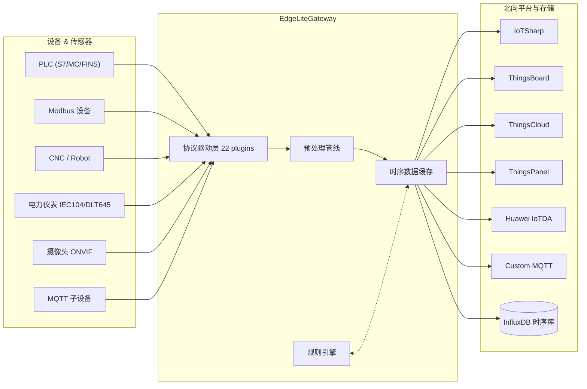

<div align="center">

# ⚡ EdgeLiteGateway

### 轻量级边缘计算物联网网关 —— 让设备接入像插U盘一样简单

[](LICENSE)
[](https://www.python.org/)
[](https://fastapi.tiangolo.com/)
[](https://vuejs.org/)
[](https://github.com/suoten/EdgeLiteGateway)
[](https://www.docker.com/)

**🇨🇳 国内首个开源 Python 边缘计算网关 | 🎯 22 种工业协议开箱即用 | 📹 视频物联网一体化 | 🚀 10 分钟 Docker 部署**

[快速开始](#-快速开始) · [功能特性](#-功能特性) · [安装部署](#-安装部署) · [技术架构](#-技术架构) · [版本对比](#-版本与路线图) · [技术支持](#-技术支持)

</div>

***

## 🚀 快速开始

> **✅ 本项目同时支持 Windows / Linux / macOS —— 选你正在用的系统，照做即可，不需要任何修改。**

---

**不管你用哪个系统，三步搞定：① 装好 Docker → ② 复制命令 → ③ 验证结果。下面按你的系统选一个看就行。**

---

### 🪟 Windows（Windows 10/11）

<details open>
<summary><b>点击展开 Windows 部署步骤</b></summary>

**前提**：确认 Docker Desktop 已安装并启动（任务栏右下角鲸鱼图标稳定，右键菜单显示 "Docker Desktop is running"）。

打开 **PowerShell**（⚠️ 不是 CMD！右键开始菜单 → Windows PowerShell），逐条执行：

```powershell
# ===== 第 1 步：克隆仓库 =====
git clone https://gitee.com/suoten/EdgeLiteGateway.git
cd EdgeLiteGateway

# ===== 第 2 步：构建前端（约 2 分钟）=====
cd web
npm install
npm run build
cd ..

# ===== 第 3 步：准备配置文件 =====
Copy-Item docker\.env.example docker\.env

# ===== 第 4 步：启动全部服务 =====
cd docker
docker compose up -d

# ===== 第 5 步：等待启动（首次约 2 分钟）=====
# 观察日志，看到 "Uvicorn running on http://127.0.0.1:8080" 即为成功
docker compose logs -f edgelite
```
> 看到启动日志后 `Ctrl+C` 退出日志，**千万不要关掉 PowerShell 窗口**（容器在后台运行）。

**[跳到 → 验证部署是否成功](#-验证部署是否成功)**

</details>

---

### 🐧 Linux / 🍎 macOS

<details open>
<summary><b>点击展开 Linux / macOS 部署步骤</b></summary>

**前提**：Linux 用户确保已安装 `docker-ce` 和 `docker-compose-plugin`（或 `docker-compose`），macOS 用户确保 Docker Desktop 已启动。

打开终端，逐条执行：

```bash
# ===== 第 1 步：克隆仓库（国内用 Gitee，海外用 GitHub）=====
git clone https://gitee.com/suoten/EdgeLiteGateway.git
cd EdgeLiteGateway

# ===== 第 2 步：构建前端（约 2 分钟）=====
cd web && npm install && npm run build && cd ..

# ===== 第 3 步：准备配置文件 =====
cp docker/.env.example docker/.env

# ===== 第 4 步：启动全部服务 =====
cd docker && docker compose up -d

# ===== 第 5 步：等待启动（首次约 2 分钟）=====
# 观察日志，看到 "Uvicorn running on http://127.0.0.1:8080" 即为成功
docker compose logs -f edgelite
```
> 看到启动日志后 `Ctrl+C` 退出日志，容器在后台继续运行。

**[跳到 → 验证部署是否成功](#-验证部署是否成功)**

</details>

---

### ✅ 验证部署是否成功

**请务必执行这一步，确保一切正常后再去用浏览器：**

```bash
# 测试 1：后端健康检查（应返回 {"status":"ok"}）
curl http://localhost:8080/health

# 测试 2：后端能正常响应登录（应返回 JSON，含 code 和 message）
curl -s -X POST http://localhost:8080/api/v1/auth/login \
  -H "Content-Type: application/json" \
  -d '{"username":"admin","password":"<启动日志中的临时密码>"}'

# 测试 3：前端页面能访问（应返回 HTML 内容）
curl -s http://localhost:3000/ | head -20
```

| 测试 | 正常结果 | 如果失败 → |
|------|---------|-----------|
| `curl :8080/health` | `{"status":"ok"}` | [后端没启动 → 排查](#-常见问题速查撞墙自救指南) |
| `curl :8080/api/v1/auth/login` | `{"code":0,...}` | 后端 API 路由有问题 |
| `curl :3000/` | 一大段 HTML | **页面显示不了 → [看这里](#-页面打不开怎么办逐步诊断)** |

> **💡 Windows 用户如果没有 `curl`**：在 PowerShell 输入 `curl.exe`（不是 `curl`），或者直接用浏览器打开 `http://localhost:3000`，看到登录页面即为成功。

**全部 3 项通过后**，浏览器打开 `http://localhost:3000`，用 `admin` / 启动日志中输出的临时密码登录（首次登录需修改密码）。

---

<details>
<summary>🎯 一键部署做了什么？（点击展开）</summary>

| 步骤 | 操作 | 耗时 | 说明 |
|------|------|------|------|
| 1 | 安装前端依赖 | 1-2 分钟 | `npm install` 安装 Vue 项目依赖 |
| 2 | 构建前端页面 | 1-2 分钟 | `npm run build` 编译生产版静态文件 |
| 3 | 生成 `.env` 配置 | 瞬间 | 从模板创建 Docker 环境变量文件 |
| 4 | 启动 4 个容器 | 1-2 分钟 | `docker compose up -d` 后台启动网关/前端/InfluxDB/MQTT |

</details>

***

## 🛠️ 前提条件（必看）

在部署之前，请确认你的环境满足以下要求。**如果不满足，下面的步骤会报错。**

| 软件                        | 最低版本   | 检查命令               | 安装方法                                                                                                      |
| ------------------------- | ------ | ------------------ | --------------------------------------------------------------------------------------------------------- |
| **Docker**                | 20.10+ | `docker --version` | Windows/Mac: [Docker Desktop](https://docs.docker.com/get-docker/)；Linux: `curl -fsSL https://get.docker.com \| sudo sh` |
| **Node.js**               | 18+    | `node --version`   | [Node.js 官网](https://nodejs.org/zh-cn/download/) 下载 LTS 版本                                                 |
| **Git**                   | 2.30+  | `git --version`    | [Git 下载](https://git-scm.com/downloads)                                                                    |
| **Python** (仅开发模式需要)       | 3.11+  | `python --version` | [Python 官网](https://www.python.org/downloads/) 下载 3.11 或 3.12                                             |

> **💡 Windows 用户特别注意**：Windows 自带 CMD 不支持 `&&` 连接命令，请使用 **PowerShell**（右键开始菜单 -> Windows PowerShell）或安装 [Git Bash](https://git-scm.com/downloads)。

***

## ⚠️ 常见问题速查（撞墙自救指南）

遇到错误不要慌，按下面的对照表处理：

| 报错信息                            | 可能原因          | 解决办法                                                                                           |
| ------------------------------- | ------------- | ---------------------------------------------------------------------------------------------- |
| `docker: command not found`     | 没装 Docker     | 去 Docker 官网下载安装                                                                                |
| `Docker Desktop is not running` | Docker 没启动    | 双击桌面 Docker 图标启动，等鲸鱼图标稳定后再执行命令                                                                 |
| `INFLUXDB_TOKEN is not set`     | 没复制 `.env` 文件 | 执行 `cp docker/.env.example docker/.env`                                                        |
| `node: command not found`       | 没装 Node.js    | 去 Node.js 官网下载安装                                                                               |
| `npm ERR! code EACCES`          | 没权限           | Windows 用管理员运行 PowerShell，Linux 加 `sudo`                                                       |
| `port 3000 is already in use`   | 端口被占用         | 关闭占用端口的程序，或修改 `docker/docker-compose.yml` 中的端口                                                 |
| `port 8080 is already in use`   | 后端端口被占用       | 同上，Tomcat/Jenkins 通常占用 8080                                                                    |
| `Error: ENOSPC: System limit`   | Linux 文件监听限制  | 执行 `echo fs.inotify.max_user_watches=524288 \| sudo tee -a /etc/sysctl.conf && sudo sysctl -p` |
| 页面打开白屏/一直在加载                    | 前端没构建或其他原因   | **[→ 看这里，分步诊断](#-页面打不开怎么办逐步诊断)**                                                    |
| `npm run build` 报内存不足           | Node.js 内存限制  | 执行 `set NODE_OPTIONS=--max-old-space-size=4096 && npm run build`                               |
| 登录时提示"用户名或密码错误"                 | 忘了密码          | 首次启动查看日志获取临时密码，如修改过请删除 `data/edgelite.db` 重新启动                                              |

> 如果上面没有你的错误，请去 [GitHub Issues](https://github.com/suoten/EdgeLiteGateway/issues) 搜索或提交新问题。

---

### 🔍 页面打不开怎么办？（逐步诊断）

这是最常见的求助问题。**不要慌，按下面顺序一条条跑，每一步都会告诉你问题出在哪里。**

> **💡 Windows PowerShell 用户注意**：下面命令中的 `ls` 换成 `dir`，`curl` 换成 `curl.exe`，其他不变。

```bash
# 诊断 1：Docker 容器在不在？
docker compose -f docker/docker-compose.yml ps
```
> ✅ 正常：4 个容器状态全是 `Up` 或 `healthy`  
> ❌ 异常有容器 `Exited` → 执行 `docker compose -f docker/docker-compose.yml logs <容器名>` 看错误日志

```bash
# 诊断 2：前端文件是否存在？
ls -la web/dist/index.html
```
> ✅ 正常：能看到文件大小（约 500 字节）  
> ❌ 文件不存在 → **前端没构建！** 执行：`cd web && npm install && npm run build && cd .. && cd docker && docker compose restart frontend`

```bash
# 诊断 3：后端是否在运行？
curl http://localhost:8080/health
```
> ✅ 正常：返回 `{"status":"ok"}`  
> ❌ 无响应 → 后端容器挂了，执行：`docker compose -f docker/docker-compose.yml logs edgelite | tail -30` 看崩溃原因

```bash
# 诊断 4：Nginx 是否在运行？
curl http://localhost:3000/ -o /dev/null -s -w "%{http_code}"
```
> ✅ 正常：返回 `200`  
> ❌ 返回 `000` 或 `502` → Nginx 前端容器异常，执行：`docker compose -f docker/docker-compose.yml restart frontend && sleep 3 && docker compose -f docker/docker-compose.yml logs frontend --tail 20`

```bash
# 诊断 5：InfluxDB 是否健康？
curl http://localhost:8086/health
```
> ✅ 正常：返回 `{"status":"pass"}`  
> ❌ → 等 30 秒再试，或 `docker compose -f docker/docker-compose.yml restart influxdb`

**以上 5 步全部通过后**，浏览器打开 `http://localhost:3000`，用 `admin` / 启动日志中输出的临时密码登录。

> 💡 **还不行？** 终极重装法：`docker compose -f docker/docker-compose.yml down -v && rm -rf data/ && cd web && npm install && npm run build && cd .. && cp docker/.env.example docker/.env && cd docker && docker compose up -d`（注意这会**清空所有数据**）

***

## 📋 功能特性

### 设备接入 / 协议适配

| 类别          | 协议                                    | 说明                        |
| ----------- | ------------------------------------- | ------------------------- |
| **通用工业**    | Modbus TCP/RTU                        | 最广泛使用的工业协议，几乎兼容所有 PLC/传感器 |
| <br />      | Siemens S7 (S7-200/300/400/1200/1500) | 西门子 PLC 全系列               |
| <br />      | Mitsubishi MC (iQ-R/Q/L/FX)           | 三菱 PLC 全系列                |
| <br />      | Omron FINS (CJ/CP/NJ)                 | 欧姆龙 PLC                   |
| <br />      | Allen-Bradley CIP/PCCC                | 罗克韦尔 AB PLC               |
| <br />      | OPC-UA Client                         | 跨平台工业互操作标准                |
| <br />      | OPC-DA Client                         | 传统 Windows OPC 兼容         |
| <br />      | MQTT Client (Sparkplug B)             | 工业物联网 MQTT 标准             |
| **电力/能源**   | IEC 60870-5-104                       | 电力远动规约，变电站/配电自动化          |
| <br />      | DL/T 645-2007                         | 国家电能表通信规约                 |
| **机器人/CNC** | ABB RWS (Web Services)                | ABB 机器人 REST API          |
| <br />      | FANUC FOCAS                           | 发那科 CNC 数控系统              |
| <br />      | KUKA Ethernet KRL                     | 库卡机器人 XML                 |
| **称重/仪表**   | Toledo MT-SICS                        | 梅特勒-托利多称重仪表               |
| **视频**      | ONVIF / PyGBSentry / HTTP             | IP 摄像头 / 视频边缘分析（企业版支持）    |
| **扩展**      | HTTP Webhook / Serial / Simulator     | 自定义拉取、串口原始数据、虚拟设备调试       |

<details>
<summary>📡 查看完整通信架构图</summary>



</details>

***

### 边缘计算引擎

- **规则引擎**：阈值告警 / 死区过滤 / 变化检测 / 条件动作（P1）
- **数据预处理**：缩放 / 死区 / 限幅 / 开方 / 累积（P1）
- **告警服务**：`钉钉 / 邮件 (SMTP) / 企业微信 / Webhook` 多渠道通知
- **断网续传**：离线缓存 + 排序回放（P1）

### 平台与系统

- **认证鉴权**：JWT (Access + Refresh) + RBAC `admin / operator / viewer`
- **审计日志**：全操作留痕，`设备/规则/告警/登录` 全维度
- **南向**：MQTT Broker (内置 `amqtt`) / Modbus Slave / Serial Bridge（P2）
- **北向**：自定义 MQTT Broker 把 EdgeLite 变成协议转换中台（P2）
- **MCP Server**：Model Context Protocol 把实时数据暴露给 AI Agent（P2）

> 💡 优先级划分：**P0 = v1.0 必需** · **P1 = v1.0 目标** · **P2 = v1.1+**

### 可视化与交互

- **看板**：设备/点位总数、在线率、今日数据量（P0）
- **SCADA 编辑器**：拖拽绑定测点 + 实时数据（P2）
- **数字孪生**：`Three.js 3D` 模型绑定 / 测点映射 / 视角同步（⚠️ 实验性）
- **数据查询**：多维度图表 / 自定义时间范围（P1）
- **PWA 离线**：Service Worker 离线可用 / 推送通知（P2）

***

## 📦 安装部署

四种部署方式分别适合不同场景，**对号入座**：

| 方式                                           | 适合谁                     | 一句话说明                           |
| -------------------------------------------- | ----------------------- | ------------------------------- |
| [Docker 一键](#-快速开始)                          | 🟢 **新手推荐**             | 克隆 → 一键命令 → 浏览器打开               |
| [Docker Compose 手动](#方式一docker-compose-手动控制) | 🟡 想看清每步做了什么            | 分步骤操作，可自定义参数                    |
| [Python 本地部署](#方式二python-本地部署开发模式)           | 🔵 开发者/二次开发             | 需要 Python 3.11 + Node.js，启动开发服务 |
| [Docker 纯容器](#方式三docker-纯容器模式无前端构建)          | 🟠 只有 Docker，没有 Node.js | Docker 全自动构建前后端，无需本地 Node.js    |

***

### 方式一：Docker Compose（手动控制）

适用于需要自定义端口、查看每步日志的场景。

```bash
# 1. 克隆仓库
git clone https://gitee.com/suoten/EdgeLiteGateway.git && cd EdgeLiteGateway

# 2. 构建前端页面（必须！web/dist 会被 nginx 挂载）
cd web && npm install && npm run build && cd ..

# 3. 配置环境变量
cp docker/.env.example docker/.env

# 4. 启动全部服务（-d = 后台运行）
cd docker && docker compose up -d

# 5. 查看日志（确认启动成功）
docker compose logs -f edgelite    # 后端日志
docker compose logs -f frontend    # 前端日志

# 6. 浏览器打开 http://localhost:3000，账号 admin，密码见启动日志
```

| 端口     | 服务             | 说明                   |
| ------ | -------------- | -------------------- |
| `3000` | 前端 (Nginx)     | Web UI               |
| `8080` | 后端 (FastAPI)   | REST API + WebSocket |
| `8086` | InfluxDB       | 时序数据库（仅 localhost）   |
| `1883` | Mosquitto MQTT | MQTT Broker          |

**停止服务**：`docker compose down`\
**完全清除（含数据）**：`docker compose down -v`

***

### 方式二：Python 本地部署（开发模式）

适用于二次开发、调试驱动、修改源码。

```bash
# 前置：必须 Python 3.11+ 且 Node.js 18+

# 1. 克隆
git clone https://gitee.com/suoten/EdgeLiteGateway.git && cd EdgeLiteGateway

# 2. 创建 Python 虚拟环境（重要！避免污染系统 Python）
python -m venv .venv

# 3. 激活虚拟环境
.venv\Scripts\activate        # Windows PowerShell
source .venv/bin/activate     # Linux / Mac

# 4. 安装后端依赖
pip install -e ".[dev]"

# 5. 准备配置文件
cp configs/config.example.yaml configs/config.yaml

# 6. 启动后端（新开一个终端）
python main.py --port 8080

# 7. 新终端启动前端开发服务器（新开一个终端）
cd web
cp .env.example .env          # 前端环境变量
npm install
npm run dev                    # Vite dev server, 默认 http://localhost:5173

# 8. 浏览器打开 http://localhost:5173
#    首次登录：admin / 启动日志中的临时密码
```

> **💡 为什么需要虚拟环境？** 隔离项目依赖，避免和系统Python其他项目冲突。如果你已激活虚拟环境，终端前面会显示 `(.venv)`。

<details>
<summary>📦 可选：安装 InfluxDB 和 Mosquitto（点击展开）</summary>

时序数据和 MQTT 功能需要额外安装：

```bash
# Ubuntu/Debian
sudo apt install influxdb mosquitto

# 或用 Docker 单独启动：
docker run -d --name influxdb -p 8086:8086 influxdb:2.7
docker run -d --name mosquitto -p 1883:1883 eclipse-mosquitto:2
```

不安装也能跑——系统会自动降级为缓存模式。

</details>

***

### 方式三：Docker 纯容器模式（无前端构建）

适用于只有 Docker、没有 Node.js 的场景。Dockerfile 内置了前端构建步骤。

```bash
# 1. 克隆仓库
git clone https://gitee.com/suoten/EdgeLiteGateway.git && cd EdgeLiteGateway

# 2. 配置环境变量
cp docker/.env.example docker/.env

# 3. 构建并启动
cd docker && docker compose build edgelite && docker compose up -d

# 4. 前端由 edgelite 容器内置服务提供
#    浏览器打开 http://localhost:8080
```

> **注意**：这种方式下 Nginx 前端服务不启动（因为没有 `web/dist`），前端由 edgelite 后端直接提供。

***

### 服务管理命令（备忘）

```bash
# 查看容器状态
docker compose -f docker/docker-compose.yml ps

# 查看所有日志
docker compose -f docker/docker-compose.yml logs -f

# 重启网关
docker compose -f docker/docker-compose.yml restart edgelite

# 删除所有数据（慎用！不可恢复）
docker compose -f docker/docker-compose.yml down -v
rm -rf data/ logs/
```

***

## 🏛️ 技术架构

```

┌──────────────────────────────────────────────────────────┐
│                      北向平台对接                          │
│  ThingsBoard  IoTSharp  ThingsCloud  ThingsPanel          │
│  Huawei IoTDA  Custom MQTT  ↑ MQTT/HTTP/REST              │
├──────────────────────────────────────────────────────────┤
│                    核心引擎 (EventBus)                     │
│  ┌─────────────────┐  ┌──────────────────┐                │
│  │  MQTT Forwarder │  │   规则引擎        │                │
│  │  预处理管线      │  │  告警/通知服务    │                │
│  └─────────────────┘  └──────────────────┘                │
├──────────────────────────────────────────────────────────┤
│                     数据抽象层 (SOR)                       │
│  ┌──────────────────────────────────────────────┐        │
│  │   SQLite ORM  │  InfluxDB 2.x Client       │        │
│  │   离线Cache   │  Tags: device,tenant,asset  │        │
│  └──────────────────────────────────────────────┘        │
├──────────────────────────────────────────────────────────┤
│                     API & WebSocket                        │
│  REST /api/v1/*  │  WS /ws/v1/{realtime,alarm,device}     │
├──────────────────────────────────────────────────────────┤
│                     驱动管理层 (Registry)                  │
│  22 Protocols: S7 / MC / FINS / AB / IEC104 / DLT645     │
│  Modbus TCP/RTU / OPC UA / OPC DA / MQTT / Fanuc / ...  │
├──────────────────────────────────────────────────────────┤
│                  视频接入层 (VideoProvider)                │
│  RTSP → PyGBSentry Analytics → MQ Events                  │
│  ONVIF Camera (PTZ, Preset, Snapshot URI)                 │
└──────────────────────────────────────────────────────────┘

```

***

## 📊 版本与路线图

### 版本差异

| 特性        |                  Community v1.0                  |                        Enterprise v1.5                       |
| --------- | :----------------------------------------------: | :----------------------------------------------------------: |
| **驱动协议**  |                        22                        |      26+ (新增 Omron NJ EtherNet/IP, GE SRTP, BACnet, KNX)     |
| **传感器模板** |                        手动                        |                           模板向导 50+                           |
| **北向平台**  | 4 (IoTSharp/ThingsBoard/ThingsCloud/ThingsPanel) | 9+ (新增 AWS IoT Core, Azure IoT Hub, Cumulocity, DMP, OneNET) |
| **视频模块**  |                     ONVIF 基础                     |                   `PyGBSentry` 视频边缘分析引擎完整版                   |
| **扩展能力**  |                        有限                        |            全 SDK (Go/JS/Python 二次开发) + Cluster 集群            |
| **技术支持**  |              Community (Issue / QQ)              |                     7×24 Priority + 远程实施                     |
| **开源协议**  |                      GPL-3.0                     |                             需商业授权                            |

### Roadmap

```
v1.0 Community    ← 项目开源  (2025 Q1) ✅
v1.1 Community    ← C 扩展 GCC/Clang/MSVC, 传感器向导  (2025 Q3) 🚧
v1.5 Enterprise   ← SDK 全面开放 (2025 Q4) 💼
v2.0 EdgeMesh     ← 分布式集群网, 跨网关协同  (2026/27远景)
```

***

## 🙋 技术支持

| 渠道                                                                | 说明                        |
| ----------------------------------------------------------------- | ------------------------- |
| [GitHub Issues](https://github.com/suoten/EdgeLiteGateway/issues) | 提交 bug / 功能建议（中英文均可）      |
| QQ 群: 1094562415                                                   | 技术交流与解答（加群请注明 "EdgeLite"） |
| 📧 <suoten@163.com>                                               | 商业授权、企业版、定制开发咨询           |

### 文档索引

| 文档                                                                                                  | 内容                  |
| --------------------------------------------------------------------------------------------------- | ------------------- |
| [Docker 部署指南](#-快速开始)                                                                               | Docker Compose 一键部署 |
| [Python 本地部署](#方式二python-本地部署开发模式)                                                                  | 开发环境搭建              |

***

## 📄 许可证

EdgeLiteGateway V1.0 Community 采用 [GPL-3.0](LICENSE) 协议开源。简单来说：

- ✅ 你可以自由使用、修改、分发源码
- ✅ 你可以用于商业项目
- ⚠️ 修改后的代码必须保留 `GPL-3.0` 协议并开源
- 💼 对 GPL 有限制的商业场景（如嵌入式 SDK）请联系 `suoten@163.com` 获取双授权

***

## ✨ 贡献者

感谢以下贡献者对 EdgeLiteGateway 项目做出的重要贡献：

<a href="https://github.com/suoten/EdgeLiteGateway/graphs/contributors">
  
</a>

***

## 🌟 Stargazers over time

[](https://star-history.com/#suoten/EdgeLiteGateway\&Date)

***

***Made with ❤️ for the Industrial IoT Community***

</parameter>
