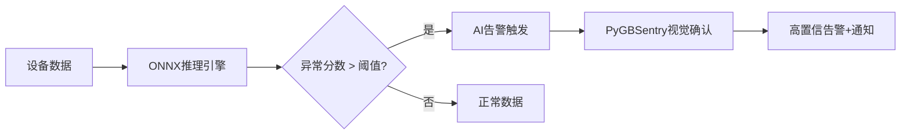

<div align="center">


# EdgeLite Gateway

### 开源边缘AI网关 —— 采集 + 思考 + 视觉确认，让边缘节点会"思考"

[](LICENSE)
[](https://www.python.org/)
[](https://fastapi.tiangolo.com/)
[](https://vuejs.org/)
[](https://github.com/suoten/EdgeLiteGateway)
[](https://www.docker.com/)
[](https://onnxruntime.ai/)

**13种核心协议** · **3个自学习AI模型** · **传感器AI+视觉AI双确认** · **10分钟Docker部署** · **512MB即可运行**

[快速开始](#-快速开始) · [在线演示](https://edgelite.jjtt.net/) · [AI能力](#-边缘ai推理引擎) · [功能全景](#-功能全景) · [技术架构](#-技术架构) · [企业版](#-企业版) · [技术支持](#-技术支持)

**[English](README_EN.md)**

</div>

---

## EdgeLite 是什么？

EdgeLite Gateway 是一个面向工业物联网场景的**开源边缘AI网关**。它不是传统网关——只搬运数据；而是在边缘侧完成**设备数据采集 → AI实时推理 → 视频联动确认**的完整闭环，让边缘节点真正会"思考"。

**一句话**：采集 + 思考 + 视觉确认，数据不出厂，延迟 < 100ms。

### 为什么需要边缘AI网关？

| 现状痛点 | EdgeLite 的回答 |
|---------|----------------|
| 传统网关只采集，不思考 | 13种协议采集 + ONNX边缘推理 + 规则引擎联动 |
| AI推理依赖云端，延迟高、数据安全风险 | 边缘侧实时推理，单次延迟 < 100ms，数据不出厂 |
| 传感器告警误报多，缺乏交叉验证 | 传感器AI异常 → 调取摄像头 → 视觉AI二次确认 → 高置信告警 |
| 多协议设备各写一套采集程序 | 一个网关统一接入，Modbus/S7/OPC UA/MQTT...全覆盖 |
| AI模型训练一次永远不变 | 3个预置模型**开箱即学**，越用越准，精度从60%进化到90% |

---

## 🚀 快速开始

> 🎯 **不想部署？先体验演示站点**：[https://edgelite.jjtt.net/](https://edgelite.jjtt.net/)　用户名 `admin` / 密码 `Edgelite@123` ⚠️ **此凭据仅用于演示环境，请勿用于生产部署！**

> **只需安装 [Docker](https://docs.docker.com/get-docker/)，无需 Node.js / Python**

> **首次启动时若未设置环境变量，系统将随机生成管理员密码并打印到控制台日志中。**

> **请在首次启动后查看日志获取初始密码，并立即修改为安全密码。**

> ⚠️ **安全警告**：首次部署**必须**设置 JWT Secret Key，否则服务无法启动。编辑 `.env` 文件，将 `EDGELITE_SECURITY__SECRET_KEY` 替换为安全随机密钥：
> ```bash
> # 生成 256 位随机密钥（复制输出结果到 .env 文件）
> python -c "import secrets; print(secrets.token_urlsafe(32))"
> ```
> Docker 部署时，编辑 `docker/.env` 中的 `SECRET_KEY` 字段。**切勿使用占位符或默认值！**

> ⚠️ **Windows 用户**：请使用 **PowerShell**（不要用 CMD），右键开始菜单 → Windows PowerShell

```bash
# 1. 克隆仓库
git clone https://gitee.com/suoten/EdgeLiteGateway.git && cd EdgeLiteGateway

# 2. 生成配置文件（Windows PowerShell 用 Copy-Item 替代 cp）
cp docker/.env.example docker/.env

# 3. 构建并启动（首次约 3-5 分钟，之后秒启）
cd docker && docker compose build edgelite && docker compose up -d

# 4. 查看启动日志
docker compose logs -f edgelite        # 看到 "Uvicorn running" 即成功，Ctrl+C 退出
```

> **首次启动后，请查看控制台日志获取初始管理员密码。**

> **首次登录后需强制修改密码。**

<details>
<summary>📡 断网缓存配置（可选）</summary>

MQTT断网缓存功能默认关闭，启用后断网时消息自动持久化到SQLite，网络恢复按序重传：

1. 登录后进入 **系统管理 → MQTT Server**
2. 开启 **启用断网缓存** 开关
3. 配置参数：
   - **离线数据库路径**：默认 `data/mqtt_offline.db`
   - **最大缓存条数**：默认 10000
   - **最大重试次数**：默认 5
   - **重传间隔(ms)**：默认 5000
4. 点击 **保存** 即可，网络中断时消息自动缓存，恢复后自动重传

</details>

<details>
<summary>🖥️ 已安装 Node.js？用混合模式（本地构建前端 + Docker 跑后端）</summary>

如果你本地有 Node.js 18+，可以先构建前端再用 Docker 启动，这样访问 http://localhost:3000 （Nginx 提供前端，速度更快）：

```bash
git clone https://gitee.com/suoten/EdgeLiteGateway.git && cd EdgeLiteGateway
cd web && npm install && npm run build && cd ..
cp docker/.env.example docker/.env
cd docker && docker compose --profile nginx up -d
```

</details>

---

## 🛠️ 前提条件

| 软件 | 最低版本 | 检查命令 | 安装方法 |
|------|---------|---------|---------|
| **Docker** | 20.10+ | `docker --version` | [Docker Desktop](https://docs.docker.com/get-docker/) 或 `curl -fsSL https://get.docker.com \| sudo sh` |
| **Git** | 2.30+ | `git --version` | [Git 下载](https://git-scm.com/downloads) |
| **Node.js** (仅混合模式) | 18+ | `node --version` | [Node.js 官网](https://nodejs.org/zh-cn/download/) |
| **Python** (仅开发模式) | 3.11+ | `python --version` | [Python 官网](https://www.python.org/downloads/) |

> **💡 Windows 用户注意**：Windows 自带 CMD 不支持 `&&` 连接命令，请使用 **PowerShell** 或安装 [Git Bash](https://git-scm.com/downloads)。

---

## ⚠️ 常见问题速查

| 报错信息 | 可能原因 | 解决办法 |
|---------|---------|---------|
| `docker: command not found` | 没装 Docker | 去 Docker 官网下载安装 |
| `Docker Desktop is not running` | Docker 没启动 | 双击桌面 Docker 图标启动 |
| `INFLUXDB_TOKEN is not set` | 没复制 `.env` 文件 | 执行 `cp docker/.env.example docker/.env` |
| `port 8080 is already in use` | 端口被占用 | 关闭占用端口的程序，或修改 docker-compose.yml 端口 |
| 页面打开白屏/一直在加载 | 前端没构建或其他原因 | 见下方逐步诊断 |
| 登录时提示"用户名或密码错误" | 忘了密码 | 首次启动查看日志获取随机生成的密码，或检查 `docker/.env` 中 `ADMIN_PASSWORD` 设置；如需重置请设置 `ADMIN_RESET_PASSWORD=true` |

<details>
<summary>🔍 页面打不开怎么办？（逐步诊断）</summary>

> **💡 Windows PowerShell 用户注意**：下面命令中的 `ls` 换成 `dir`，`curl` 换成 `curl.exe`

```bash
# 诊断 1：Docker 容器在不在？
cd docker && docker compose ps
```
> ✅ 正常：3 个容器（edgelite / influxdb / mosquitto）状态全是 `Up` 或 `healthy`
> ❌ 异常有容器 `Exited` → 执行 `docker compose logs <容器名>` 看错误日志

```bash
# 诊断 2：后端是否在运行？
curl http://localhost:8080/health
```
> ✅ 正常：返回 `{"status":"ok"}`

```bash
# 诊断 3：InfluxDB 是否健康？
curl http://localhost:8086/health
```
> ✅ 正常：返回 `{"status":"pass"}`

**以上 3 步全部通过后**，浏览器打开 `http://localhost:8080`，用 `admin` 及你在 `docker/.env` 中设置的 `ADMIN_PASSWORD` 登录。

> 💡 **还不行？** 终极重装法（注意这会**清空所有数据**）：
>
> **Linux / Mac：**
> ```bash
> cd docker && docker compose down -v && rm -rf ../data/ && cp .env.example .env && docker compose build edgelite && docker compose up -d
> ```
> **Windows PowerShell：**
> ```powershell
> cd docker; docker compose down -v; Remove-Item -Recurse -Force ../data/; Copy-Item .env.example .env; docker compose build edgelite; docker compose up -d
> ```

</details>

---

## 📋 功能全景

### 设备接入 · 13种核心协议

| 类别 | 协议 | 说明 |
|------|------|------|
| **通用工业** | Modbus TCP / RTU | 最广泛使用的工业协议，几乎兼容所有 PLC/传感器 |
| **PLC** | Siemens S7 (S7-200~1500) | 西门子 PLC 全系列 |
| **PLC** | Mitsubishi MC (iQ-R/Q/L/FX) | 三菱 PLC 全系列 |
| **PLC** | Omron FINS (CJ/CP/NJ) | 欧姆龙 PLC |
| **PLC** | Allen-Bradley CIP/PCCC | 罗克韦尔 AB PLC |
| **OPC** | OPC UA Client | 跨平台工业互操作标准 |
| **OPC** | OPC DA Client | 传统 Windows OPC 兼容 |
| **IoT** | MQTT Client | 物联网发布/订阅协议 |
| **IoT** | HTTP Webhook | HTTP 推送/拉取，最低接入门槛 |
| **视频** | ONVIF Camera | IP 摄像头发现/PTZ控制/RTSP流 |

| **内置服务** | Modbus Slave | 内置 Modbus 从站，支持调试级联 |
| **内置服务** | MQTT Server | 内置 MQTT Broker (amqtt)，前端直连 |
| **工具** | Simulator | 虚拟设备模拟器，开发测试必备 |

### 北向平台 · 6个

IoTSharp · ThingsBoard · ThingsCloud · ThingsPanel · Huawei IoTDA · Custom MQTT

### 🧠 边缘AI推理引擎

> **这是 EdgeLite 与传统网关的核心差异——在边缘侧完成AI推理，数据不出厂，延迟 < 100ms**

- **ONNX Runtime 推理引擎**：原生支持 `.onnx` 模型，边缘侧实时推理，单次延迟 < 100ms，最大并发 4
- **3个自学习预置模型**：
  - `elg-anomaly-v1` 异常检测：物理仿真冷启动 → EWMA自适应 → 告警反馈优化
  - `elg-trend-v1` 趋势预测：物理方程启动 → 在线ARIMA参数辨识 → 残差驱动结构升级
  - `elg-threshold-v1` 动态阈值：初始分位数 → STL季节性分解 → 用户反馈调整
- **模型自学习闭环**：采集 → 推理 → 反馈 → 参数更新，单设备本地闭环，无云端依赖，精度从 60% → 90% 可见进化
- **模型热加载**：不重启网关即可替换模型，运维零中断
- **AI → 规则引擎联动**：AI推理结果直接驱动告警规则
- **MCP Server**：Model Context Protocol，AI Agent 可查询设备实时状态
- **传感器AI + 视觉AI 双确认**：传感器异常 → AI确认 → 调取摄像头 → 视觉AI二次确认 → 高置信告警

<details>
<summary>📊 AI模型自学习进化过程（点击展开）</summary>

**3个预置模型不是静态文件，是"部署即学习，越用越准"的活模型：**

| 时间 | 异常检测 F1 | 趋势预测 MAPE | 动态阈值误报率 | 阶段 |
|------|-----------|-------------|--------------|------|
| Day 0 | 0.60 | 25% | 30% | 🟡 物理仿真基线 |
| Day 3 | 0.65 | 20% | 20% | 🟡 在线参数适应中 |
| Day 7 | 0.75 | 15% | 10% | 🟢 参数基本收敛 |
| Day 14 | 0.82 | 12% | 6% | 🟢 反馈优化中 |
| Day 30 | 0.88 | 9% | 4% | 🔵 稳定进化 |
| Day 60+ | 0.90+ | 8% | 3% | 🟣 成熟模型 |

**全程单设备本地闭环，数据不出厂，无需联网即可持续进化。**

自学习进化看板可视化展示：精度曲线 + 参数变化事件 + 反馈统计 + 预测vs实际对比图

</details>

<details>
<summary>⚙️ 启用AI推理引擎（点击展开）</summary>

AI推理引擎默认启用，Docker 部署时已自动包含 ONNX Runtime，无需额外操作。

如需关闭 AI 引擎，在 `configs/config.yaml` 中设置：

```yaml
ai_inference:
  enabled: false
```

</details>



### 核心引擎

| 模块 | 能力 |
|------|------|
| **采集调度器** | 最大并发50, 看门狗超时重启, 帧错误率告警 |
| **规则引擎** | 阈值告警 / 死区过滤 / 变化检测 / 条件动作 / AI条件联动 |
| **边缘规则引擎** | 单点阈值评估, <100ms延迟 |
| **预处理管线** | 缩放/死区/限幅/开方/累积/滤波/聚合/插值/滑动窗口/降采样 |
| **流计算引擎 (CEP)** | 滚动/滑动/会话窗口, 移动平均/极值统计, 变化率监控, 模式检测 |
| **协议转换网关** | Modbus↔OPC UA 数据映射, 类型转换, 配置化映射规则 |
| **脚本引擎** | JavaScript/Lua 沙箱执行 |
| **数据质量监控** | 5维度评分(采集率/延迟/完整性/异常率/连续性) |
| **告警服务** | 5级严重度, 升级/抑制/统计(MTTR/MTBF) |
| **告警关联** | 时间窗口 + 设备拓扑根因分析 |
| **通知服务** | 钉钉 / 邮件 / 企业微信 / Webhook 4通道 |
| **设备联动** | 事件触发跨设备联动 |
| **链路冗余** | 主备链路自动切换 |
| **熔断器** | Closed/Open/Half-Open 三态 |
| **断网缓存** | SQLite持久化, 恢复后按序重传 |
| **多网关级联** | mDNS邻居发现, 父子/对等拓扑 |
| **命令审批** | 多级审批链(Operator/Supervisor/Manager) |
| **配置热更新** | 文件监控 + API + 敏感变更检测 |
| **配置版本管理** | 变更历史与回滚 |

### 安全能力

| 模块 | 能力 |
|------|------|
| **JWT认证** | Access(30min) + Refresh(7天), HS256/384/512 |
| **RBAC** | 3角色(admin/operator/viewer) × 30权限 |
| **密码安全** | bcrypt(rounds=13, OWASP 2023) |
| **Token撤销** | 内存撤销列表, 上限100000 |
| **登录保护** | 5次失败锁定15分钟 |
| **TLS安全** | 双向TLS(mTLS), CA自签名, 证书轮换 |
| **敏感配置加密** | Fernet对称加密, 敏感字段自动识别 |
| **固件签名** | RSA-2048/4096 + ECDSA(P-256/P-384) |
| **审计日志** | 全操作留痕, 独立SQLite |
| **数据脱敏** | 密码/Token/API Key/JWT/手机号等正则脱敏 |
| **CSRF防护** | X-CSRF-Token校验 |
| **请求限流** | 按IP/路径限流(60次/分钟) |

### 运维能力

- **Prometheus指标**：/metrics端点, 4级指标, Grafana集成
- **日志聚合**：多源收集 / 结构化JSON / 级别动态调整 / 归档轮转 / 远程分发
- **OTA升级**：远程升级 / 回滚 / 版本管理
- **串口透传**：串口↔TCP透传, IP白名单
- **系统自检**：自检端点 + 聚合健康检查

### 可视化与交互

- **看板**：设备/点位总数、在线率、今日数据量
- **SCADA 编辑器**：拖拽绑定测点 + 实时数据
- **数字孪生**：Three.js 3D 模型绑定 / 测点映射 / 视角同步（实验性）
- **数据查询**：多维度图表 / 自定义时间范围
- **国际化**：zh-CN + en-US

### 📸 界面预览

| 仪表盘 | 规则管理 |
| --- | --- |
|  |  |

| 组态编辑器 | 服务管理 |
| --- | --- |
|  |  |

---

## 📊 社区版量化总览

| 维度 | 数值 |
|------|------|
| 南向协议驱动 | 13 个 |
| 北向平台适配器 | 6 个 |
| API路由模块 | 45 个 |
| 前端页面 | 35 个 |
| 预置AI模型 | 3 个（均支持自学习） |
| 安全模块 | 12 个 |
| 核心引擎模块 | 33 个 |
| 业务服务模块 | 24 个 |
| 告警通知渠道 | 4 个 |
| RBAC权限项 | 30 个 |
| 测试文件 | 196 个 |

---

## 🏛️ 技术架构

```
┌──────────────────────────────────────────────────────────┐
│                      北向平台对接                          │
│  ThingsBoard  IoTSharp  ThingsCloud  ThingsPanel          │
│  Huawei IoTDA  Custom MQTT  ↑ MQTT/HTTP/REST              │
├──────────────────────────────────────────────────────────┤
│                    核心引擎 (EventBus)                     │
│  ┌─────────────────┐  ┌──────────────────┐                │
│  │  MQTT Forwarder │  │   规则引擎        │                │
│  │  预处理管线      │  │  告警/通知服务    │                │
│  └─────────────────┘  └──────────────────┘                │
├──────────────────────────────────────────────────────────┤
│                  边缘AI推理引擎                             │
│  ONNX Runtime  │  3自学习模型  │  模型热加载  │  AI→规则联动 │
├──────────────────────────────────────────────────────────┤
│                     数据抽象层 (SOR)                       │
│  ┌──────────────────────────────────────────────┐        │
│  │   SQLite ORM  │  InfluxDB 2.x Client       │        │
│  │   离线Cache   │  Tags: device,tenant,asset  │        │
│  └──────────────────────────────────────────────┘        │
├──────────────────────────────────────────────────────────┤
│                     API & WebSocket                        │
│  REST /api/v1/*  │  WS /ws/v1/{realtime,alarm,device}     │
├──────────────────────────────────────────────────────────┤
│                     驱动管理层 (Registry)                  │
│  13 Core Protocols: S7/MC/FINS/AB/Modbus TCP/RTU/         │
│  OPC UA/DA/MQTT/HTTP/ONVIF/Modbus Slave/Simulator         │

└──────────────────────────────────────────────────────────┘
```

**技术栈**：Python 3.11+ / FastAPI / SQLAlchemy 2.0 / ONNX Runtime / Vue 3 / Naive UI / InfluxDB 2.x / SQLite WAL

---

## 🤔 为什么选择 EdgeLite？

| 维度 | EdgeLite Gateway | 传统采集网关 | 中心化AI平台 |
|------|:---:|:---:|:---:|
| **边缘AI推理** | ✅ ONNX + 3自学习模型 | ❌ 无内置 | ❌ AI在中心侧 |
| **推理延迟** | < 100ms（本地推理） | N/A | 依赖网络，断网不可用 |
| **断网可用** | ✅ 推理+告警+缓存全本地 | ✅ 采集本地可用 | ❌ 断网即失效 |
| **规则引擎+告警** | ✅ 内置 | ❌ 需自行开发 | ✅ 但依赖网络 |
| **视频联动** | ✅ ONVIF + 视频AI | ❌ 不支持 | ⚠️ 延迟高 |
| **工业协议** | 13种核心协议 | 12+种 | 需网关中转 |
| **部署门槛** | Docker 10分钟 | 中等 | 需服务器+网络 |
| **内存占用** | ~80-150 MB | ~30-60 MB | N/A |
| **二次开发** | Python（低门槛，生态丰富） | C#/.NET（中等门槛） | 受限 |

> EdgeLite 的核心优势是**边缘侧自治**——AI推理、规则告警、断网缓存全部在本地完成，不依赖中心侧网络。中心化AI平台适合大规模模型训练和跨节点分析，EdgeLite 适合需要**低延迟、断网可用、数据不出厂**的边缘智能场景。

---

## 📦 安装部署

| 方式 | 适合谁 | 一句话说明 |
|------|--------|-----------|
| [Docker 纯容器（推荐）](#-快速开始) | 新手推荐 | 只需 Docker，克隆 → 构建镜像 → 浏览器打开 |
| [Docker + 本地前端](#方式一docker-compose--本地前端) | 有 Node.js，想要 Nginx 加速 | 本地构建前端，Docker 跑后端 |
| [Python 本地部署](#方式二python-本地部署开发模式) | 开发者/二次开发 | Python 3.11 + Node.js，启动开发服务 |

### 方式一：Docker Compose + 本地前端

```bash
git clone https://gitee.com/suoten/EdgeLiteGateway.git && cd EdgeLiteGateway
cd web && npm install && npm run build && cd ..
cp docker/.env.example docker/.env
cd docker && docker compose --profile nginx up -d
# 浏览器打开 http://localhost:3000，账号 admin，密码为 docker/.env 中设置的 ADMIN_PASSWORD
```

| 端口 | 服务 | 说明 |
|------|------|------|
| `3000` | 前端 (Nginx) | Web UI |
| `8080` | 后端 (FastAPI) | REST API + WebSocket |
| `8086` | InfluxDB | 时序数据库（仅 localhost） |
| `1883` | Mosquitto MQTT | MQTT Broker |

### 方式二：Python 本地部署（开发模式）

```bash
git clone https://gitee.com/suoten/EdgeLiteGateway.git && cd EdgeLiteGateway
python -m venv .venv
.venv\Scripts\activate        # Windows PowerShell
source .venv/bin/activate     # Linux / Mac
pip install -e ".[dev]"
cp configs/config.example.yaml configs/config.yaml
python main.py --port 8080    # 新终端启动后端
cd web && cp .env.example .env && npm install && npm run dev  # 新终端启动前端
# 浏览器打开 http://localhost:5173
```

<details>
<summary>📦 可选：安装 InfluxDB 和 Mosquitto</summary>

```bash
# Ubuntu/Debian
sudo apt install influxdb mosquitto
# 或用 Docker 单独启动：
docker run -d --name influxdb -p 8086:8086 influxdb:2.7
docker run -d --name mosquitto -p 1883:1883 eclipse-mosquitto:2
```

不安装也能跑——系统会自动降级为缓存模式。

</details>

---

## 🏢 企业版

> **社区版解决"能不能用"的问题，企业版解决"敢不敢用在生产"的问题。**

EdgeLite 企业版在社区版全部能力基础上，围绕**可靠性、安全性、AI深度、运维效率**四个方向增值，适合生产环境部署。

### 企业版核心增值

| 增值方向 | 社区版 | 企业版 | 解决什么问题 |
|---------|--------|--------|------------|
| **可靠性** | 单机部署，无故障转移 | 高可用集群 + K8s自愈 + 自动故障转移 | 生产环境不能接受宕机停服 |
| **安全性** | 基础TLS + JWT | 国密SM2/SM3/SM4 + 等保2.0合规 + LDAP/SSO + 字段级加密 | 满足等保合规和国密要求 |
| **AI深度** | 3模型本地自学习(60%→90%) | +AI主动发现未知异常 + 联邦学习多节点协同 + 行业专用模型 | 从"AI被动检测"到"AI主动发现+群体协同" |

### 协议扩展 · +8个企业级协议

| 协议 | 场景 | 说明 |
|------|------|------|
| BACnet | 楼宇自控 | BACnet/IP + MSTP，楼宇场景完整支持 |
| OPC UA Server | 内置服务 | 对外暴露网关数据为OPC UA节点 |
| FANUC CNC | CNC加工 | FOCAS完整接口，CNC状态+程序管理 |
| IEC 104 | 电力SCADA | 电力调度标准协议 |
| DL/T 645 | 电力计量 | 电能表数据采集 |
| EtherCAT | 实时以太网 | 运动控制场景 |
| KNX | 楼宇控制 | 楼宇智能控制标准 |
| 专用协议SDK | 扩展框架 | 自定义协议快速开发框架+模板 |

### AI能力增强 · 三级智能进化

> **社区版AI"自己学"，企业版AI"会创造、会协同"**

| 智能等级 | 能力 | 社区版 | 企业版 | 用户体验 |
|---------|------|:------:|:------:|---------|
| **L1 边缘推理** | ONNX实时推理 + 模型热加载 | ✅ | ✅ | 数据不出厂，延迟 < 100ms |
| **L2 自学习进化** | 3模型开箱即学，越用越准 | ✅ | ✅ | 部署即学习，精度从60%→90%可见进化 |
| **L3 主动发现** | AI自动发现未知异常模式，推荐新模型 | ❌ | ✅ | "发现新异常模式[振动异常]，已生成检测模型，是否启用？" |

**L3 主动发现**：社区版3个模型只检测已知异常。企业版AI持续分析残差数据，自动发现从未见过的异常模式，生成检测模型并推荐给你——从"被动检测"升级为"主动探索"。

<details>
<summary>📊 企业版AI完整能力对比（点击展开）</summary>

| AI维度 | 社区版 | 企业版 |
|--------|--------|--------|
| 推理引擎 | ONNX Runtime | ONNX Runtime + OpenVINO(Intel硬件加速) |
| 预置模型 | 3个自学习模型 | 3个自学习模型 + 行业专用模型(振动/泄漏/电池/能耗等) |
| 自学习闭环 | ✅ 单设备本地(60%→90%) | ✅ + 联邦学习多节点协同(→95%+)，数据不出厂 |
| AI主动发现 | ❌ | ✅ 残差模式挖掘 + DTW聚类 + 自动推荐第4/5/N个模型 |
| 智能诊断对话 | ❌ | ✅ "最近为什么这么多误报？" → 根因分析+调优建议 |
| 异常根因分析 | ❌ | ✅ 告警关联 + 设备拓扑 + 历史模式 → 自动定位根因 |
| 报告自动生成 | ❌ | ✅ 自动生成周报/月报：设备在线率、告警统计、AI进化效果 |
| 自定义模型 | ❌ | ✅ 上传ONNX/TFLite/PMML + A-B测试 + 模型版本管理 + 性能监控 |
| 联邦学习 | ❌ | ✅ FedAvg聚合 + 差分隐私(ε=3.0) + 梯度压缩，多节点协同进化 |
| 模型市场 | ❌ | ✅ 精选模型 + 行业套件，一键部署 |
| 视频联动 | 基础(异常→视频确认) | 深度(二次确认+自动录像+智能巡检+多摄像头联动) |
| 推理延迟 | < 100ms | < 50ms(OpenVINO加速) |

</details>

### 部署与安全增强

| 维度 | 社区版 | 企业版 |
|------|--------|--------|
| 部署模式 | 单机 Docker | + 高可用集群 / K8s Helm / K8s Operator |
| 边云协同 | ❌ | ✅ 多网关统一管理 + 配置双向同步 + 数据汇聚 |
| 离线部署 | 手动导入镜像 | ✅ 一键离线安装包 + 离线许可证 |
| 国产化 | 未验证 | ✅ 麒麟V10 / 统信UOS / openEuler + TDengine + 达梦 |
| 国密算法 | ❌ | ✅ SM2(签名/密钥交换) + SM3(哈希) + SM4(加密) + 国密SSL |
| 等保合规 | ❌ | ✅ 等保2.0三级合规报表 + 安全配置基线 |
| 企业认证 | JWT + RBAC | + LDAP/AD + SSO + OAuth2.0 + 双因子认证 |
| 时序数据库 | InfluxDB | InfluxDB / TDengine(可选) |
| 北向扩展 | 6个平台 | + Kafka + 时序库直写(ClickHouse) |

### 运维与服务

| 维度 | 社区版 | 企业版 |
|------|--------|--------|
| 运维方式 | 逐台管理 | 边云协同 + 批量配置 + 远程运维 + 集中监控 |
| OTA升级 | 单机升级 | 集中升级 + 灰度发布 + 版本回滚 |
| 数据备份 | 手动 | 自动定时备份 + 一键恢复 + 云端备份 |
| 技术支持 | 社区(Issue/QQ) | 5×8商业支持 + SLA 99.9% + 培训 + 定制开发 |

### 版本对比速查

| 功能 | 社区版 | 企业版 |
|------|:------:|:------:|
| 13个核心协议 | ✅ | ✅ |
| +8个企业级协议 | ❌ | ✅ |
| 3个自学习AI模型 | ✅ | ✅ |
| AI主动发现新模式 | ❌ | ✅ |
| 联邦学习多节点协同 | ❌ | ✅ |
| 高可用集群 | ❌ | ✅ |
| 边云协同 | ❌ | ✅ |
| 国密+等保 | ❌ | ✅ |
| LDAP/SSO | ❌ | ✅ |
| 商业技术支持 | ❌ | ✅ |
| 开源协议 | GPL-3.0 | 商业许可 |

> 💡 **社区版不阉割核心能力**：13协议、3自学习AI模型、规则引擎、告警、视频联动等完整开源。企业版在"更可靠、更安全、更聪明、更好管"上增值。
>
> 💡 **无缝升级**：社区版 → 企业版无跨版本迁移，数据与配置完整保留。

### 企业版典型客户

| 客户类型 | 核心需求 | 付费驱动力 |
|---------|---------|-----------|
| 中型制造企业 | 多产线采集 + AI预警 + 高可用 | 停机损失大，需故障转移 |
| 系统集成商 | 快速交付 + 可二开 + 多项目复用 | 缩短交付周期，项目利润提升 |
| 电力/能源企业 | IEC104/DLT645 + 等保合规 + 国密 | 合规硬性要求 |
| 楼宇/园区 | BACnet + KNX + 集中运维 | 多系统统一管理 |
| 涉密/军工 | 离线部署 + 国密 + 数据不出厂 | 安全合规硬性要求 |

📧 企业版咨询：<suoten@163.com>

---

## 📊 版本与路线图

> 详细更新日志请参阅 [CHANGELOG.md](./CHANGELOG.md)

```
V1.0 社区版（当前）────────────────────────────────────
  │  13种核心协议 + ONNX推理 + 3自学习模型 + AI联动
  │  规则引擎 + 告警 + 视频联动 + 6个北向平台
  │  JWT/RBAC + 基础TLS + 审计 + Docker部署
  │
  ▼
V1.1 社区版 AI自学习深化 ────────────────────────────
  │  ★ 3模型从静态变活：物理仿真冷启动+在线适应+反馈优化
  │  + 自学习进化看板(精度曲线+参数事件+反馈统计)
  │  + 告警反馈闭环(确认→正样本/忽略→负样本→增量重训)
  │  用户可见：模型精度从60%→90%的进化过程
  │
  ▼
企业版（基于社区版V1.1）────────────────────────────
  │  Phase 1: +8协议扩展 + 国密 + 等保 + 国产化适配
  │  Phase 2: 高可用集群 + AI主动发现 + 行业模型
  │  Phase 3: 边云协同 + 联邦学习 + 批量运维 + 插件市场
  │  Phase 4: K8s Operator + 灾难恢复 + 深化演进
```

---

## 🙋 技术支持

| 渠道 | 说明 |
|------|------|
| [GitHub Issues](https://github.com/suoten/EdgeLiteGateway/issues) | 提交 bug / 功能建议（中英文均可） |
| QQ 群: 1094562415 | 技术交流与解答（加群请注明 "EdgeLite"） |
| 📧 <suoten@163.com> | 商业授权、企业版、定制开发咨询 |

---

## 📄 许可证

EdgeLite Gateway V1.0 Community 采用 [GPL-3.0](LICENSE) 协议开源。简单来说：

- ✅ 你可以自由使用、修改、分发源码
- ✅ 你可以用于商业项目
- ⚠️ 修改后的代码必须保留 `GPL-3.0` 协议并开源
- 💼 对 GPL 有限制的商业场景（如嵌入式 SDK）请联系 `suoten@163.com` 获取双授权

---

## 🔒 安全披露

发现安全漏洞？请按 [SECURITY.md](SECURITY.md) 中的流程私下报告，**勿在公开 Issue 中提交**。我们承诺 2 个工作日内确认收悉，严重漏洞 30 天内发布修复。

---

## ✨ 贡献者

感谢以下贡献者对 EdgeLite Gateway 项目做出的重要贡献：

<a href="https://github.com/suoten/EdgeLiteGateway/graphs/contributors">
  
</a>

---

## 🌟 Stargazers over time

[](https://star-history.com/#suoten/EdgeLiteGateway&Date)

---

***Made with ❤️ for the Industrial IoT Community***
