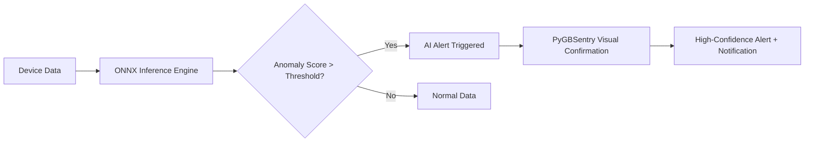

<div align="center">


# EdgeLite Gateway

### Open-Source Edge AI Gateway — Collect + Think + Visually Confirm, Making Edge Nodes "Think"

[](LICENSE)
[](https://www.python.org/)
[](https://fastapi.tiangolo.com/)
[](https://vuejs.org/)
[](https://github.com/suoten/EdgeLiteGateway)
[](https://www.docker.com/)
[](https://onnxruntime.ai/)

**13 Core Protocols** · **3 Self-Learning AI Models** · **Sensor AI + Vision AI Dual Confirmation** · **10-Min Docker Deploy** · **Runs on 512MB RAM**

[Quick Start](#-quick-start) · [Live Demo](https://edgelite.jjtt.net/) · [AI Capabilities](#-edge-ai-inference-engine) · [Features](#-features) · [Architecture](#-architecture) · [Enterprise](#-enterprise) · [Support](#-support)

**[中文](README.md)**

</div>

***

## What is EdgeLite?

EdgeLite Gateway is an **open-source edge AI gateway** designed for industrial IoT scenarios. It's not a traditional gateway that merely forwards data — it completes the full closed loop of **device data collection → real-time AI inference → video-linked confirmation** at the edge, making edge nodes truly "think."

**In one sentence**: Collect + Think + Visually Confirm, data stays on-premises, latency < 100ms.

### Why do you need an Edge AI Gateway?

| Current Pain Point                                                   | EdgeLite's Answer                                                                                            |
| -------------------------------------------------------------------- | ------------------------------------------------------------------------------------------------------------ |
| Traditional gateways only collect, they don't think                  | 13-protocol collection + ONNX edge inference + rule engine linkage                                           |
| AI inference relies on the cloud — high latency, data security risks | Edge-side real-time inference, single-inference latency < 100ms, data stays on-premises                      |
| Sensor alerts have too many false positives, lack cross-validation   | Sensor AI anomaly → call camera → Vision AI secondary confirmation → high-confidence alert                   |
| Multi-protocol devices each need a separate collection program       | One gateway for unified access — Modbus/S7/OPC UA/MQTT... full coverage                                      |
| AI models are trained once and never change                          | 3 preset models **learn out of the box**, getting more accurate over time, precision evolves from 60% to 90% |

***

## 🚀 Quick Start

> 🎯 **Don't want to deploy? Try the demo first**: <https://edgelite.jjtt.net/>　Username `admin` / Password `Edgelite@123`⚠️ **These credentials are for the demo environment ONLY. Do NOT use in production!**

> **Only** **[Docker](https://docs.docker.com/get-docker/)** **required. No Node.js / Python needed.**

> **If the environment variable is not set on first startup, the system will randomly generate an admin password and print it to the console log.**

> **Please check the logs after first startup to get the initial password, and change it to a secure password immediately.**

> ⚠️ **Windows users**: Use **PowerShell** (not CMD). Right-click Start → Windows PowerShell.

```bash
# 1. Clone the repository
git clone https://gitee.com/suoten/EdgeLiteGateway.git && cd EdgeLiteGateway

# 2. Generate configuration (Windows PowerShell: use Copy-Item instead of cp)
cp docker/.env.example docker/.env

# 3. Build and start (first build ~3-5 min, instant thereafter)
cd docker && docker compose build edgelite && docker compose up -d

# 4. Watch startup logs
docker compose logs -f edgelite        # "Uvicorn running" = success, Ctrl+C to exit
```

> **After first startup, check the console log for the initial admin password.**

> **Password change is required on first login.**

<details>
<summary>📡 Offline Cache Configuration (Optional)</summary>

MQTT offline cache is disabled by default. When enabled, messages are automatically persisted to SQLite during network disconnection and retransmitted in order upon recovery:

1. After login, navigate to **System Management → MQTT Server**
2. Enable the **Enable Offline Cache** toggle
3. Configure parameters:
   - **Offline DB Path**: default `data/mqtt_offline.db`
   - **Max Queue Size**: default 10000
   - **Max Retries**: default 5
   - **Retry Interval (ms)**: default 5000
4. Click **Save** — messages are automatically cached during network interruption and retransmitted upon recovery

</details>

<details>
<summary>🖥️ Have Node.js? Use hybrid mode (local frontend build + Docker backend)</summary>

If you have Node.js 18+ locally, build the frontend first then start with Docker. Access via <http://localhost:3000> (Nginx serves frontend, faster):

```bash
git clone https://gitee.com/suoten/EdgeLiteGateway.git && cd EdgeLiteGateway
cd web && npm install && npm run build && cd ..
cp docker/.env.example docker/.env
cd docker && docker compose --profile nginx up -d
```

</details>

***

## 🛠️ Prerequisites

| Software                       | Minimum Version | Check Command      | Installation                                                                                            |
| ------------------------------ | --------------- | ------------------ | ------------------------------------------------------------------------------------------------------- |
| **Docker**                     | 20.10+          | `docker --version` | [Docker Desktop](https://docs.docker.com/get-docker/) or `curl -fsSL https://get.docker.com \| sudo sh` |
| **Git**                        | 2.30+           | `git --version`    | [Git Download](https://git-scm.com/downloads)                                                           |
| **Node.js** (hybrid mode only) | 18+             | `node --version`   | [Node.js Official](https://nodejs.org/en/download/)                                                     |
| **Python** (dev mode only)     | 3.11+           | `python --version` | [Python Official](https://www.python.org/downloads/)                                                    |

> **💡 Windows users note**: Windows CMD does not support `&&` for chaining commands. Use **PowerShell** or install [Git Bash](https://git-scm.com/downloads).

***

## ⚠️ Common Issues Quick Reference

| Error Message                    | Likely Cause                        | Solution                                                                                |
| -------------------------------- | ----------------------------------- | --------------------------------------------------------------------------------------- |
| `docker: command not found`      | Docker not installed                | Download and install Docker from the official website                                   |
| `Docker Desktop is not running`  | Docker not started                  | Double-click the Docker desktop icon to start                                           |
| `INFLUXDB_TOKEN is not set`      | `.env` file not copied              | Run `cp docker/.env.example docker/.env`                                                |
| `port 8080 is already in use`    | Port occupied                       | Close the program using the port, or modify docker-compose.yml port                     |
| Page shows blank / stuck loading | Frontend not built or other reasons | See step-by-step diagnosis below                                                        |
| Login says "invalid credentials" | Forgot password                     | Check logs for temp password on first startup, or delete `data/edgelite.db` and restart |

<details>
<summary>🔍 Page not loading? Step-by-step diagnosis</summary>

> **💡 Windows PowerShell users**: Replace `ls` with `dir`, `curl` with `curl.exe`

```bash
# Diagnosis 1: Are Docker containers running?
cd docker && docker compose ps
```

> ✅ Normal: All 3 containers (edgelite / influxdb / mosquitto) show `Up` or `healthy`
> ❌ Any container `Exited` → run `docker compose logs <container-name>` for error details

```bash
# Diagnosis 2: Is the backend running?
curl http://localhost:8080/health
```

> ✅ Normal: Returns `{"status":"ok"}`

```bash
# Diagnosis 3: Is InfluxDB healthy?
curl http://localhost:8086/health
```

> ✅ Normal: Returns `{"status":"pass"}`

**Once all 3 checks pass**, open `http://localhost:8080` and log in with `admin` and the `ADMIN_PASSWORD` you set in `docker/.env`.

> 💡 **Still not working?** Nuclear reset (⚠️ **this wipes all data**):
>
> **Linux / Mac:**
>
> ```bash
> cd docker && docker compose down -v && rm -rf ../data/ && cp .env.example .env && docker compose build edgelite && docker compose up -d
> ```
>
> **Windows PowerShell:**
>
> ```powershell
> cd docker; docker compose down -v; Remove-Item -Recurse -Force ../data/; Copy-Item .env.example .env; docker compose build edgelite; docker compose up -d
> ```

</details>

***

## 📋 Features

### Device Connectivity · 13 Core Protocols

| Category               | Protocol                    | Description                                                                   |
| ---------------------- | --------------------------- | ----------------------------------------------------------------------------- |
| **General Industrial** | Modbus TCP / RTU            | Most widely used industrial protocol, compatible with almost all PLCs/sensors |
| **PLC**                | Siemens S7 (S7-200\~1500)   | Full Siemens PLC family                                                       |
| **PLC**                | Mitsubishi MC (iQ-R/Q/L/FX) | Full Mitsubishi PLC family                                                    |
| **PLC**                | Omron FINS (CJ/CP/NJ)       | Omron PLC                                                                     |
| **PLC**                | Allen-Bradley CIP/PCCC      | Rockwell AB PLC                                                               |
| **OPC**                | OPC UA Client               | Cross-platform industrial interoperability standard                           |
| **OPC**                | OPC DA Client               | Legacy Windows OPC compatibility                                              |
| **IoT**                | MQTT Client                 | IoT publish/subscribe protocol                                                |
| **IoT**                | HTTP Webhook                | HTTP push/pull, lowest integration barrier                                    |
| **Video**              | ONVIF Camera                | IP camera discovery/PTZ control/RTSP stream                                   |

\| **Built-in Service** | Modbus Slave | Built-in Modbus slave, supports debug cascading |
\| **Built-in Service** | MQTT Server | Built-in MQTT Broker (amqtt), frontend direct connect |
\| **Tool** | Simulator | Virtual device simulator, essential for development & testing |

### Northbound Platforms · 6

IoTSharp · ThingsBoard · ThingsCloud · ThingsPanel · Huawei IoTDA · Custom MQTT

### 🧠 Edge AI Inference Engine

> **This is EdgeLite's core differentiator from traditional gateways — AI inference at the edge, data stays on-premises, latency < 100ms**

- **ONNX Runtime Inference Engine**: Native `.onnx` model support, edge-side real-time inference, single-inference latency < 100ms, max concurrency 4
- **3 Self-Learning Preset Models**:
  - `elg-anomaly-v1` Anomaly Detection: Physics simulation cold start → EWMA adaptation → alarm feedback optimization
  - `elg-trend-v1` Trend Prediction: Physics equation startup → online ARIMA parameter identification → residual-driven structural upgrade
  - `elg-threshold-v1` Dynamic Threshold: Initial quantiles → STL seasonal decomposition → user feedback adjustment
- **Model Self-Learning Closed Loop**: Collect → Infer → Feedback → Parameter update, single-device local closed loop, no cloud dependency, precision visibly evolves from 60% → 90%
- **Hot Model Reload**: Swap models without restarting the gateway — zero downtime
- **AI → Rule Engine Linkage**: AI inference results directly drive alarm rules
- **MCP Server**: Model Context Protocol, AI Agents can query real-time device status
- **Sensor AI + Vision AI Dual Confirmation**: Sensor anomaly → AI confirmation → call camera → Vision AI secondary confirmation → high-confidence alert

<details>
<summary>📊 AI Model Self-Learning Evolution Process (click to expand)</summary>

**The 3 preset models are not static files — they are "deploy and learn, getting more accurate over time" living models:**

| Time    | Anomaly Detection F1 | Trend Prediction MAPE | Dynamic Threshold False Positive Rate | Phase                          |
| ------- | -------------------- | --------------------- | ------------------------------------- | ------------------------------ |
| Day 0   | 0.60                 | 25%                   | 30%                                   | 🟡 Physics simulation baseline |
| Day 3   | 0.65                 | 20%                   | 20%                                   | 🟡 Online parameter adaptation |
| Day 7   | 0.75                 | 15%                   | 10%                                   | 🟢 Parameters mostly converged |
| Day 14  | 0.82                 | 12%                   | 6%                                    | 🟢 Feedback optimization       |
| Day 30  | 0.88                 | 9%                    | 4%                                    | 🔵 Stable evolution            |
| Day 60+ | 0.90+                | 8%                    | 3%                                    | 🟣 Mature model                |

**Entire process is single-device local closed loop, data stays on-premises, no internet required for continuous evolution.**

Self-learning evolution dashboard visualization: precision curves + parameter change events + feedback statistics + predicted vs. actual comparison charts

</details>

<details>
<summary>⚙️ Enable AI Inference Engine (click to expand)</summary>

The AI inference engine is enabled by default. Docker deployment automatically includes ONNX Runtime — no extra steps needed.

To disable the AI engine, set in `configs/config.yaml`:

```yaml
ai_inference:
  enabled: false
```

</details>



### Core Engine

| Module                          | Capability                                                                                                       |
| ------------------------------- | ---------------------------------------------------------------------------------------------------------------- |
| **Collection Scheduler**        | Max concurrency 50, watchdog timeout restart, frame error rate alarm                                             |
| **Rule Engine**                 | Threshold alarm / deadband filtering / change detection / conditional actions / AI conditional linkage           |
| **Edge Rule Engine**            | Single-point threshold evaluation, <100ms latency                                                                |
| **Preprocessing Pipeline**      | Scale/deadband/clamp/square root/accumulate/filter/aggregate/interpolate/sliding window/downsample               |
| **Stream Compute Engine (CEP)** | Rolling/sliding/session windows, moving average/extreme statistics, rate-of-change monitoring, pattern detection |
| **Protocol Bridge**             | Modbus↔OPC UA data mapping, type conversion, configurable mapping rules                                          |
| **Script Engine**               | JavaScript/Lua sandbox execution                                                                                 |
| **Data Quality Monitor**        | 5-dimension scoring (collection rate/latency/completeness/anomaly rate/continuity)                               |
| **Alarm Service**               | 5 severity levels, escalation/suppression/statistics (MTTR/MTBF)                                                 |
| **Alarm Correlation**           | Time window + device topology root cause analysis                                                                |
| **Notification Service**        | DingTalk / Email / WeCom / Webhook 4 channels                                                                    |
| **Device Linkage**              | Event-triggered cross-device linkage                                                                             |
| **Link Redundancy**             | Primary-backup link auto-switch                                                                                  |
| **Circuit Breaker**             | Closed/Open/Half-Open three-state                                                                                |
| **Offline Cache**               | SQLite persistence, ordered retransmission after recovery                                                        |
| **Multi-Gateway Cascade**       | mDNS neighbor discovery, parent-child/peer topology                                                              |
| **Command Approval**            | Multi-level approval chain (Operator/Supervisor/Manager)                                                         |
| **Config Hot Reload**           | File monitoring + API + sensitive change detection                                                               |
| **Config Version Management**   | Change history and rollback                                                                                      |

### Security

| Module                          | Capability                                                         |
| ------------------------------- | ------------------------------------------------------------------ |
| **JWT Auth**                    | Access(30min) + Refresh(7 days), HS256/384/512                     |
| **RBAC**                        | 3 roles (admin/operator/viewer) × 30 permissions                   |
| **Password Security**           | bcrypt(rounds=13, OWASP 2023)                                      |
| **Token Revocation**            | In-memory revocation list, max 100000                              |
| **Login Protection**            | 5 failed attempts → lock for 15 minutes                            |
| **TLS Security**                | Mutual TLS (mTLS), CA self-signed, certificate rotation            |
| **Sensitive Config Encryption** | Fernet symmetric encryption, auto-detect sensitive fields          |
| **Firmware Signing**            | RSA-2048/4096 + ECDSA(P-256/P-384)                                 |
| **Audit Log**                   | Full operation trail, independent SQLite                           |
| **Data Masking**                | Regex masking for passwords/Tokens/API Keys/JWT/phone numbers etc. |
| **CSRF Protection**             | X-CSRF-Token validation                                            |
| **Rate Limiting**               | Per-IP/path rate limiting (60 requests/min)                        |

### Operations

- **Prometheus Metrics**: /metrics endpoint, 4-level metrics, Grafana integration
- **Log Aggregation**: Multi-source collection / structured JSON / dynamic level adjustment / archive rotation / remote distribution
- **OTA Upgrade**: Remote upgrade / rollback / version management
- **Serial Passthrough**: Serial↔TCP passthrough, IP whitelist
- **System Self-Check**: Self-check endpoint + aggregated health check

### Visualization & Interaction

- **Dashboard**: Device/point counts, online rate, today's data volume
- **SCADA Editor**: Drag-and-drop point binding + real-time data
- **Digital Twin**: Three.js 3D model binding / point mapping / view sync (experimental)
- **Data Query**: Multi-dimensional charts / custom time ranges
- **Internationalization**: zh-CN + en-US

### 📸 Screenshots

| Dashboard              | Rule Management        |
| ---------------------- | ---------------------- |
|  |  |

| SCADA Editor           | Service Management     |
| ---------------------- | ---------------------- |
|  |  |

***

## 📊 Community Edition Quantitative Overview

| Dimension                    | Count                         |
| ---------------------------- | ----------------------------- |
| Southbound Protocol Drivers  | 13                            |
| Northbound Platform Adapters | 6                             |
| API Route Modules            | 45                            |
| Frontend Pages               | 35                            |
| Preset AI Models             | 3 (all support self-learning) |
| Security Modules             | 12                            |
| Core Engine Modules          | 33                            |
| Business Service Modules     | 24                            |
| Alarm Notification Channels  | 4                             |
| RBAC Permission Items        | 30                            |
| Test Files                   | 196                           |

***

## 🏛️ Architecture

```
┌──────────────────────────────────────────────────────────┐
│                    Northbound Platforms                    │
│  ThingsBoard  IoTSharp  ThingsCloud  ThingsPanel          │
│  Huawei IoTDA  Custom MQTT  ↑ MQTT/HTTP/REST              │
├──────────────────────────────────────────────────────────┤
│                   Core Engine (EventBus)                   │
│  ┌─────────────────┐  ┌──────────────────┐                │
│  │  MQTT Forwarder │  │   Rule Engine     │                │
│  │  Preprocessing  │  │  Alarm/Notify     │                │
│  └─────────────────┘  └──────────────────┘                │
├──────────────────────────────────────────────────────────┤
│                  Edge AI Inference Engine                   │
│  ONNX Runtime  │  3 Self-Learning Models  │  Hot Reload  │  AI→Rule Linkage │
├──────────────────────────────────────────────────────────┤
│                    Data Abstraction (SOR)                   │
│  ┌──────────────────────────────────────────────┐        │
│  │   SQLite ORM  │  InfluxDB 2.x Client         │        │
│  │  Offline Cache│  Tags: device,tenant,asset   │        │
│  └──────────────────────────────────────────────┘        │
├──────────────────────────────────────────────────────────┤
│                    API & WebSocket                          │
│  REST /api/v1/*  │  WS /ws/v1/{realtime,alarm,device}     │
├──────────────────────────────────────────────────────────┤
│                   Driver Layer (Registry)                   │
│  13 Core Protocols: S7/MC/FINS/AB/Modbus TCP/RTU/         │
│  OPC UA/DA/MQTT/HTTP/ONVIF/Modbus Slave/Simulator         │
└──────────────────────────────────────────────────────────┘
```

**Tech Stack**: Python 3.11+ / FastAPI / SQLAlchemy 2.0 / ONNX Runtime / Vue 3 / Naive UI / InfluxDB 2.x / SQLite WAL

***

## 🤔 Why Choose EdgeLite?

| Dimension                |            EdgeLite Gateway            | Traditional Collection Gateway |         Centralized AI Platform        |
| ------------------------ | :------------------------------------: | :----------------------------: | :------------------------------------: |
| **Edge AI Inference**    |     ✅ ONNX + 3 self-learning models    |         ❌ Not built-in         |       ❌ AI is on the central side      |
| **Inference Latency**    |        < 100ms (local inference)       |               N/A              | Network-dependent, unavailable offline |
| **Offline Capable**      | ✅ Inference + alarms + cache all local |   ✅ Collection works locally   |          ❌ Fails when offline          |
| **Rule Engine + Alarms** |               ✅ Built-in               |   ❌ Need to develop yourself   |         ✅ But network-dependent        |
| **Video Linkage**        |           ✅ ONVIF + Vision AI          |         ❌ Not supported        |             ⚠️ High latency            |
| **Industrial Protocols** |            13 core protocols           |               12+              |         Requires gateway relay         |
| **Deployment Barrier**   |          Docker in 10 minutes          |             Medium             |        Requires server + network       |
| **Memory Usage**         |               \~80-150 MB              |           \~30-60 MB           |                   N/A                  |
| **Custom Development**   |  Python (low barrier, rich ecosystem)  |    C#/.NET (medium barrier)    |                 Limited                |

> EdgeLite's core advantage is **edge-side autonomy** — AI inference, rule alarms, and offline cache all run locally, independent of central-side networks. Centralized AI platforms are suitable for large-scale model training and cross-node analysis, while EdgeLite is designed for edge intelligence scenarios requiring **low latency, offline capability, and data staying on-premises**.

***

## 📦 Installation & Deployment

| Method                                                              | For Whom                              | One-Liner                                       |
| ------------------------------------------------------------------- | ------------------------------------- | ----------------------------------------------- |
| [Docker containers (recommended)](#-quick-start)                    | Beginners                             | Just Docker: clone → build image → open browser |
| [Docker + Local Frontend](#method-1-docker-compose--local-frontend) | Have Node.js, want Nginx acceleration | Build frontend locally, Docker runs backend     |
| [Python Local Deploy](#method-2-python-local-deployment-dev-mode)   | Developers / customization            | Python 3.11 + Node.js, start dev services       |

### Method 1: Docker Compose + Local Frontend

```bash
git clone https://gitee.com/suoten/EdgeLiteGateway.git && cd EdgeLiteGateway
cd web && npm install && npm run build && cd ..
cp docker/.env.example docker/.env
cd docker && docker compose --profile nginx up -d
# Open http://localhost:3000, username admin, password is ADMIN_PASSWORD set in docker/.env
```

| Port   | Service           | Description                           |
| ------ | ----------------- | ------------------------------------- |
| `3000` | Frontend (Nginx)  | Web UI                                |
| `8080` | Backend (FastAPI) | REST API + WebSocket                  |
| `8086` | InfluxDB          | Time-series database (localhost only) |
| `1883` | Mosquitto MQTT    | MQTT Broker                           |

### Method 2: Python Local Deployment (Dev Mode)

```bash
git clone https://gitee.com/suoten/EdgeLiteGateway.git && cd EdgeLiteGateway
python -m venv .venv
.venv\Scripts\activate        # Windows PowerShell
source .venv/bin/activate     # Linux / Mac
pip install -e ".[dev]"
cp configs/config.example.yaml configs/config.yaml
python main.py --port 8080    # New terminal: start backend
cd web && cp .env.example .env && npm install && npm run dev  # New terminal: start frontend
# Open http://localhost:5173
```

<details>
<summary>📦 Optional: Install InfluxDB and Mosquitto</summary>

```bash
# Ubuntu/Debian
sudo apt install influxdb mosquitto
# Or start with Docker:
docker run -d --name influxdb -p 8086:8086 influxdb:2.7
docker run -d --name mosquitto -p 1883:1883 eclipse-mosquitto:2
```

Works without them — the system automatically degrades to cache mode.

</details>

***

## 🏢 Enterprise

> **The Community Edition solves "can it work?", the Enterprise Edition solves "can I trust it in production?"**

EdgeLite Enterprise Edition builds on the full Community Edition capabilities, adding value across **reliability, security, AI depth, and operational efficiency**, suitable for production deployments.

### Enterprise Core Value-Add

| Value Direction | Community Edition                     | Enterprise Edition                                                                                                    | What Problem It Solves                                                        |
| --------------- | ------------------------------------- | --------------------------------------------------------------------------------------------------------------------- | ----------------------------------------------------------------------------- |
| **Reliability** | Single-node deployment, no failover   | HA cluster + K8s self-healing + automatic failover                                                                    | Production environments can't accept downtime                                 |
| **Security**    | Basic TLS + JWT                       | National Crypto SM2/SM3/SM4 + Level Protection 2.0 compliance + LDAP/SSO + field-level encryption                     | Meet compliance and national crypto requirements                              |
| **AI Depth**    | 3-model local self-learning (60%→90%) | +AI proactive discovery of unknown anomalies + federated learning multi-node collaboration + industry-specific models | From "AI passive detection" to "AI proactive discovery + group collaboration" |

### Protocol Extension · +8 Enterprise Protocols

| Protocol            | Scenario            | Description                                             |
| ------------------- | ------------------- | ------------------------------------------------------- |
| BACnet              | Building automation | BACnet/IP + MSTP, complete building scenario support    |
| OPC UA Server       | Built-in service    | Expose gateway data as OPC UA nodes                     |
| FANUC CNC           | CNC machining       | FOCAS full interface, CNC status + program management   |
| IEC 104             | Power SCADA         | Power dispatch standard protocol                        |
| DL/T 645            | Power metering      | Electricity meter data collection                       |
| EtherCAT            | Real-time Ethernet  | Motion control scenarios                                |
| KNX                 | Building control    | Building intelligent control standard                   |
| Custom Protocol SDK | Extension framework | Custom protocol rapid development framework + templates |

### AI Capability Enhancement · 3-Level Intelligent Evolution

> **Community Edition AI "learns on its own", Enterprise Edition AI "can create and collaborate"**

| Intelligence Level             | Capability                                                        | Community | Enterprise | User Experience                                                                              |
| ------------------------------ | ----------------------------------------------------------------- | :-------: | :--------: | -------------------------------------------------------------------------------------------- |
| **L1 Edge Inference**          | ONNX real-time inference + hot model reload                       |     ✅     |      ✅     | Data stays on-premises, latency < 100ms                                                      |
| **L2 Self-Learning Evolution** | 3 models learn out of the box, getting more accurate              |     ✅     |      ✅     | Deploy and learn, precision visibly evolves from 60%→90%                                     |
| **L3 Proactive Discovery**     | AI auto-discovers unknown anomaly patterns, recommends new models |     ❌     |      ✅     | "Discovered new anomaly pattern \[vibration anomaly], generated detection model, enable it?" |

**L3 Proactive Discovery**: The Community Edition's 3 models only detect known anomalies. Enterprise Edition AI continuously analyzes residual data, automatically discovers never-before-seen anomaly patterns, generates detection models and recommends them to you — upgrading from "passive detection" to "proactive exploration."

<details>
<summary>📊 Enterprise AI Full Capability Comparison (click to expand)</summary>

| AI Dimension                  | Community Edition                  | Enterprise Edition                                                                                             |
| ----------------------------- | ---------------------------------- | -------------------------------------------------------------------------------------------------------------- |
| Inference Engine              | ONNX Runtime                       | ONNX Runtime + OpenVINO (Intel hardware acceleration)                                                          |
| Preset Models                 | 3 self-learning models             | 3 self-learning models + industry-specific models (vibration/leak/battery/energy etc.)                         |
| Self-Learning Loop            | ✅ Single-device local (60%→90%)    | ✅ + Federated learning multi-node collaboration (→95%+), data stays on-premises                                |
| AI Proactive Discovery        | ❌                                  | ✅ Residual pattern mining + DTW clustering + auto-recommend 4th/5th/Nth model                                  |
| Intelligent Diagnostic Dialog | ❌                                  | ✅ "Why so many false alarms lately?" → Root cause analysis + tuning suggestions                                |
| Anomaly Root Cause Analysis   | ❌                                  | ✅ Alarm correlation + device topology + historical patterns → auto-locate root cause                           |
| Auto Report Generation        | ❌                                  | ✅ Auto-generate weekly/monthly reports: device online rate, alarm statistics, AI evolution results             |
| Custom Models                 | ❌                                  | ✅ Upload ONNX/TFLite/PMML + A-B testing + model version management + performance monitoring                    |
| Federated Learning            | ❌                                  | ✅ FedAvg aggregation + differential privacy (ε=3.0) + gradient compression, multi-node collaborative evolution |
| Model Marketplace             | ❌                                  | ✅ Curated models + industry suites, one-click deploy                                                           |
| Video Linkage                 | Basic (anomaly→video confirmation) | Deep (secondary confirmation + auto-recording + intelligent inspection + multi-camera linkage)                 |
| Inference Latency             | < 100ms                            | < 50ms (OpenVINO acceleration)                                                                                 |

</details>

### Deployment & Security Enhancement

| Dimension                   | Community Edition   | Enterprise Edition                                                                   |
| --------------------------- | ------------------- | ------------------------------------------------------------------------------------ |
| Deployment Mode             | Single-node Docker  | + HA cluster / K8s Helm / K8s Operator                                               |
| Edge-Cloud Collaboration    | ❌                   | ✅ Multi-gateway unified management + bidirectional config sync + data aggregation    |
| Offline Deployment          | Manual image import | ✅ One-click offline installer + offline license                                      |
| Domestic Platform           | Not verified        | ✅ Kylin V10 / UOS / openEuler + TDengine + DM Database                               |
| National Crypto             | ❌                   | ✅ SM2 (signature/key exchange) + SM3 (hash) + SM4 (encryption) + National Crypto SSL |
| Level Protection Compliance | ❌                   | ✅ Level Protection 2.0 Class 3 compliance report + security configuration baseline   |
| Enterprise Auth             | JWT + RBAC          | + LDAP/AD + SSO + OAuth2.0 + two-factor authentication                               |
| Time-Series Database        | InfluxDB            | InfluxDB / TDengine (optional)                                                       |
| Northbound Extension        | 6 platforms         | + Kafka + time-series DB direct write (ClickHouse)                                   |

### Operations & Services

| Dimension         | Community Edition     | Enterprise Edition                                                            |
| ----------------- | --------------------- | ----------------------------------------------------------------------------- |
| Operations Mode   | Per-device management | Edge-cloud collaboration + batch config + remote ops + centralized monitoring |
| OTA Upgrade       | Single-node upgrade   | Centralized upgrade + canary deployment + version rollback                    |
| Data Backup       | Manual                | Auto scheduled backup + one-click recovery + cloud backup                     |
| Technical Support | Community (Issue/QQ)  | 5×8 commercial support + SLA 99.9% + training + custom development            |

### Version Comparison Quick Reference

| Feature                                     | Community |     Enterprise     |
| ------------------------------------------- | :-------: | :----------------: |
| 13 Core Protocols                           |     ✅     |          ✅         |
| +8 Enterprise Protocols                     |     ❌     |          ✅         |
| 3 Self-Learning AI Models                   |     ✅     |          ✅         |
| AI Proactive Discovery                      |     ❌     |          ✅         |
| Federated Learning Multi-Node Collaboration |     ❌     |          ✅         |
| HA Cluster                                  |     ❌     |          ✅         |
| Edge-Cloud Collaboration                    |     ❌     |          ✅         |
| National Crypto + Level Protection          |     ❌     |          ✅         |
| LDAP/SSO                                    |     ❌     |          ✅         |
| Commercial Technical Support                |     ❌     |          ✅         |
| Open Source License                         |  GPL-3.0  | Commercial License |

> 💡 **Community Edition doesn't cripple core capabilities**: 13 protocols, 3 self-learning AI models, rule engine, alarms, video linkage etc. are fully open source. Enterprise Edition adds value in "more reliable, more secure, smarter, easier to manage."
>
> 💡 **Seamless Upgrade**: Community Edition → Enterprise Edition with no cross-version migration, data and configuration fully preserved.

### Enterprise Typical Customers

| Customer Type          | Core Need                                               | Payment Driver                                |
| ---------------------- | ------------------------------------------------------- | --------------------------------------------- |
| Mid-size Manufacturing | Multi-line collection + AI early warning + HA           | High downtime cost, need failover             |
| System Integrators     | Rapid delivery + customizable + multi-project reuse     | Shorter delivery cycle, higher project margin |
| Power/Energy           | IEC104/DLT645 + compliance + national crypto            | Compliance is mandatory                       |
| Buildings/Campuses     | BACnet + KNX + centralized ops                          | Unified multi-system management               |
| Classified/Military    | Offline deployment + national crypto + data on-premises | Security compliance is mandatory              |

📧 Enterprise Inquiry: <suoten@163.com>

***

## 📊 Versions & Roadmap

> For detailed changelog, see [CHANGELOG.md](./CHANGELOG.md)

```
V1.0 Community Edition (Current) ────────────────────────────
  │  13 core protocols + ONNX inference + 3 self-learning models + AI linkage
  │  Rule engine + alarms + video linkage + 6 northbound platforms
  │  JWT/RBAC + basic TLS + audit + Docker deployment
  │
  ▼
V1.1 Community Edition AI Self-Learning Deepening ────────────
  │  ★ 3 models from static to living: physics simulation cold start + online adaptation + feedback optimization
  │  + Self-learning evolution dashboard (precision curves + parameter events + feedback statistics)
  │  + Alarm feedback closed loop (confirm → positive sample / ignore → negative sample → incremental retrain)
  │  User-visible: model precision evolution from 60% → 90%
  │
  ▼
Enterprise Edition (based on Community V1.1) ────────────────
  │  Phase 1: +8 protocol extension + national crypto + Level Protection + domestic platform adaptation
  │  Phase 2: HA cluster + AI proactive discovery + industry models
  │  Phase 3: Edge-cloud collaboration + federated learning + batch ops + plugin marketplace
  │  Phase 4: K8s Operator + disaster recovery + deep evolution
```

***

## 🙋 Support

| Channel                                                           | Description                                                          |
| ----------------------------------------------------------------- | -------------------------------------------------------------------- |
| [GitHub Issues](https://github.com/suoten/EdgeLiteGateway/issues) | Submit bugs / feature requests (English or Chinese)                  |
| QQ Group: 1094562415                                              | Technical discussion & Q\&A (mention "EdgeLite" when joining)        |
| 📧 <suoten@163.com>                                               | Commercial licensing, enterprise edition, custom development inquiry |

***

## 📄 License

EdgeLite Gateway V1.0 Community is open-sourced under [GPL-3.0](LICENSE). In short:

- ✅ You may freely use, modify, and distribute the source code
- ✅ You may use it in commercial projects
- ⚠️ Modified code must retain the `GPL-3.0` license and be open-sourced
- 💼 For commercial scenarios with GPL limitations (e.g., embedded SDK), contact `suoten@163.com` for dual licensing

***

## 🔒 Security Disclosure

Found a security vulnerability? Please report it privately following the process in [SECURITY.md](SECURITY.md) — **do not open a public issue**. We acknowledge reports within 2 business days and release fixes for severe vulnerabilities within 30 days.

## ✨ Contributors

Thanks to the following contributors for their important contributions to the EdgeLite Gateway project:

<a href="https://github.com/suoten/EdgeLiteGateway/graphs/contributors">
  
</a>

***

## 🌟 Stargazers over time

[](https://star-history.com/#suoten/EdgeLiteGateway\&Date)

***

***Made with ❤️ for the Industrial IoT Community***
