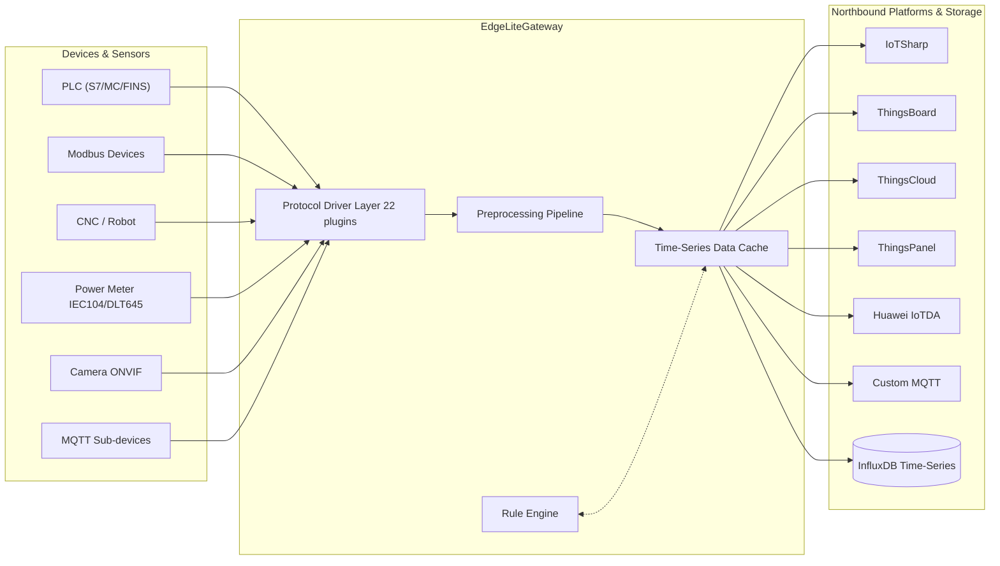

<div align="center">

# ⚡ EdgeLiteGateway

### Lightweight Edge Computing IoT Gateway — Device Connectivity as Simple as Plug & Play

[](LICENSE)
[](https://www.python.org/)
[](https://fastapi.tiangolo.com/)
[](https://vuejs.org/)
[](https://github.com/suoten/EdgeLiteGateway)
[](https://www.docker.com/)

**🇨🇳 China's First Open-Source Python Edge Gateway | 🎯 22 Industrial Protocols Out-of-the-Box | 📹 Video-IoT Unified | 🚀 10-Min Docker Deploy**

[Quick Start](#-quick-start) · [Features](#-features) · [Deployment](#-deployment) · [Architecture](#-architecture) · [Versions](#-versions--roadmap) · [Support](#-support)

**[中文](README.md)**

</div>

***

## 🚀 Quick Start

> **Only [Docker](https://docs.docker.com/get-docker/) required. No Node.js / Python needed.**

> ⚠️ **Windows users**: Use **PowerShell** (not CMD). Right-click Start → Windows PowerShell.

```bash
# 1. Clone the repository
git clone https://gitee.com/suoten/EdgeLiteGateway.git && cd EdgeLiteGateway

# 2. Generate configuration (Windows PowerShell: use "Copy-Item" instead of "cp")
cp docker/.env.example docker/.env

# 3. Build and start (first build ~3-5 min, instant thereafter)
#    Users in China: if build hangs/times out, configure a registry mirror
#    Docker Desktop → Settings → Docker Engine → add "registry-mirrors": ["https://docker.1ms.run"]
cd docker && docker compose build edgelite && docker compose up -d

# 4. Watch startup logs
docker compose logs -f edgelite     # "Uvicorn running" = success, Ctrl+C to exit
```

Open http://localhost:8080 in your browser. Username: `admin` / Password: `admin123` (password change required on first login).

<details>
<summary>🖥️ Have Node.js? Hybrid mode (local frontend build + Docker backend)</summary>

If you have Node.js 18+ locally, build the frontend first then use Docker for the backend. Access via http://localhost:3000 (Nginx serves frontend, faster):

```bash
git clone https://gitee.com/suoten/EdgeLiteGateway.git && cd EdgeLiteGateway
cd web && npm install && npm run build && cd ..
cp docker/.env.example docker/.env
cd docker && docker compose --profile nginx up -d
```

</details>

---

<details>
<summary>🎯 What does the one-click deploy do? (click to expand)</summary>

| Step | Operation | Time | Description |
|------|-----------|------|-------------|
| 1 | Clone code | seconds | `git clone` downloads the project |
| 2 | Generate config | instant | `cp .env.example .env` creates env vars |
| 3 | Build image | 3-5 min | Docker auto-installs dependencies, builds frontend & backend |
| 4 | Start containers | 30 sec | `docker compose up -d` starts gateway/InfluxDB/MQTT |

</details>

***

## 🛠️ Prerequisites (Read Before Deploying)

Verify your environment meets these requirements before proceeding. **If not met, the commands below will fail.**

| Software                     | Minimum | Check command       | Install                                                                                                         |
| ---------------------------- | ------- | ------------------- | --------------------------------------------------------------------------------------------------------------- |
| **Docker**                   | 20.10+  | `docker --version`  | Windows/Mac: [Docker Desktop](https://docs.docker.com/get-docker/); Linux: `curl -fsSL https://get.docker.com \| sudo sh` |
| **Git**                      | 2.30+   | `git --version`     | [Git Download](https://git-scm.com/downloads)                                                                    |
| **Node.js** (hybrid mode only) | 18+   | `node --version`    | [Node.js](https://nodejs.org/en/download/) download LTS                                                          |
| **Python** (dev mode only)   | 3.11+   | `python --version`  | [Python](https://www.python.org/downloads/) download 3.11 or 3.12                                                |

> **💡 Windows users**: Windows CMD does not support `&&` for chaining commands. Use **PowerShell** (right-click Start → Windows PowerShell) or install [Git Bash](https://git-scm.com/downloads). The `cp` command works in PowerShell (alias for `Copy-Item`).

***

## ⚠️ Common Issues Quick Reference

Don't panic if you hit an error — check the table below:

| Error Message                    | Likely Cause              | Solution                                                                                    |
| -------------------------------- | ------------------------- | ------------------------------------------------------------------------------------------- |
| `docker: command not found`      | Docker not installed      | Download Docker from the official website                                                   |
| `Docker Desktop is not running`  | Docker not started        | Double-click Docker desktop icon, wait for whale icon to stabilize                          |
| `INFLUXDB_TOKEN is not set`      | `.env` file not copied    | Run `cp docker/.env.example docker/.env`                                                    |
| `node: command not found`        | Node.js not installed (hybrid mode) | Use pure container mode instead — no Node.js required                              |
| `npm ERR! code EACCES`           | Permission denied         | Windows: run PowerShell as Admin; Linux: prepend `sudo`                                     |
| `port 3000 is already in use`    | Port conflict             | Close the conflicting program, or modify port in `docker/docker-compose.yml`                |
| `port 8080 is already in use`    | Backend port conflict     | Same as above; Tomcat/Jenkins commonly uses 8080                                            |
| `Error: ENOSPC: System limit`    | Linux file watch limit    | Run `echo fs.inotify.max_user_watches=524288 \| sudo tee -a /etc/sysctl.conf && sudo sysctl -p` |
| Page shows blank / stuck loading | Frontend not built, etc.  | **[→ Step-by-step diagnosis](#-page-not-loading-step-by-step-diagnosis)**                   |
| `npm run build` out of memory    | Node.js memory limit      | Run `set NODE_OPTIONS=--max-old-space-size=4096 && npm run build`                          |
| Login says "invalid credentials" | Forgot password           | First startup: check logs for temp password; if changed, delete `data/edgelite.db` and restart |

> If your error isn't listed above, search or submit at [GitHub Issues](https://github.com/suoten/EdgeLiteGateway/issues).

---

### 🔍 Page Not Loading? Step-by-Step Diagnosis

This is the most common support request. **Don't panic — run these commands in order; each will tell you what's wrong.**

> **💡 Windows PowerShell users**: Replace `ls` with `dir`, `curl` with `curl.exe`. All commands run from the **project root directory**.

```bash
# Diagnosis 1: Are Docker containers running?
cd docker && docker compose ps
```
> ✅ Normal: All 3 containers (edgelite / influxdb / mosquitto) show `Up` or `healthy`
> ❌ Any container `Exited` → run `docker compose logs <container-name>` for error details

```bash
# Diagnosis 2: Is the backend running?
curl http://localhost:8080/health
```
> ✅ Normal: Returns `{"status":"ok"}`
> ❌ No response → backend crashed, run `docker compose logs edgelite --tail 30`

```bash
# Diagnosis 3: Is InfluxDB healthy?
curl http://localhost:8086/health
```
> ✅ Normal: Returns `{"status":"pass"}`
> ❌ → Wait 30 seconds and try again, or `docker compose restart influxdb`

**Once all 3 checks pass**, open `http://localhost:8080` and log in with `admin` / `admin123`.

> 💡 **Still not working?** Nuclear reset (⚠️ **this wipes all data**):
>
> **Linux / Mac:**
> ```bash
> cd docker && docker compose down -v && rm -rf ../data/ && cp .env.example .env && docker compose build edgelite && docker compose up -d
> ```
> **Windows PowerShell:**
> ```powershell
> cd docker; docker compose down -v; Remove-Item -Recurse -Force ../data/; Copy-Item .env.example .env; docker compose build edgelite; docker compose up -d
> ```

***

## 🎯 When Do You Need EdgeLite?

> **Factory Data Collection**: Your workshop runs Siemens, Mitsubishi, Modbus, and other protocol-based equipment. You want a single gateway for unified collection, threshold alarms, and direct data reporting to MES — instead of writing a separate collector for each protocol.

> **Campus Energy + Video Integration**: You need to connect electricity/water meter data and GB28181 camera feeds to the same platform, displaying real-time energy consumption and surveillance on a 3D visualization dashboard — instead of separate energy and video systems.

> **Remote Serial Port Operations**: You need to remotely debug on-site serial devices (PLCs, instruments) without deploying VPNs at each site. EdgeLite's serial port passthrough gives you direct access.

***

## 📋 Features

### Device Connectivity / Protocol Adaptation

| Category | Protocol | Description |
|----------|----------|-------------|
| **General Industrial** | Modbus TCP/RTU | Most widely used industrial protocol, compatible with almost all PLCs/sensors |
| **General Industrial** | Siemens S7 (S7-200/300/400/1200/1500) | Full Siemens PLC family |
| **General Industrial** | Mitsubishi MC (iQ-R/Q/L/FX) | Full Mitsubishi PLC family |
| **General Industrial** | Omron FINS (CJ/CP/NJ) | Omron PLC |
| **General Industrial** | Allen-Bradley CIP/PCCC | Rockwell AB PLC |
| **General Industrial** | OPC-UA Client | Cross-platform industrial interoperability standard |
| **General Industrial** | OPC-DA Client | Legacy Windows OPC compatibility |
| **General Industrial** | MQTT Client (Sparkplug B) | Industrial IoT MQTT standard |
| **Power/Energy** | IEC 60870-5-104 | Power telecontrol protocol, substation/distribution automation |
| **Power/Energy** | DL/T 645-2007 | Chinese national electricity meter communication protocol |
| **Robot/CNC** | ABB RWS (Web Services) | ABB Robot REST API |
| **Robot/CNC** | FANUC FOCAS | FANUC CNC system |
| **Robot/CNC** | KUKA Ethernet KRL | KUKA Robot XML |
| **Weighing/Instrument** | Toledo MT-SICS | Mettler Toledo weighing instrument |
| **Video** | ONVIF / PyGBSentry / HTTP | IP Camera / edge video analytics (Enterprise edition) |
| **Extension** | HTTP Webhook / Serial / Simulator | Custom pull, raw serial data, virtual device debugging |

<details>
<summary>📡 Full Communication Architecture Diagram</summary>


</details>

***

### Edge Computing Engine

- **Rule Engine**: Threshold alarms / Deadband filtering / Change detection / Conditional actions (P1)
- **Data Preprocessing**: Scaling / Deadband / Clipping / Square root / Accumulation (P1)
- **Alarm Service**: `DingTalk / Email (SMTP) / WeCom / Webhook` multi-channel notifications
- **Store-and-Forward**: Offline caching + ordered replay (P1)

### Platform & System

- **Auth**: JWT (Access + Refresh) + RBAC `admin / operator / viewer`
- **Audit Log**: Full operation trail — `device/rule/alarm/login` all dimensions
- **Southbound**: MQTT Broker (built-in `amqtt`) / Modbus Slave / Serial Bridge (P2)
- **Northbound**: Custom MQTT Broker — turn EdgeLite into a protocol translation hub (P2)
- **MCP Server**: Model Context Protocol — expose real-time data to AI Agents (P2)

> 💡 Priority: **P0 = v1.0 required** · **P1 = v1.0 target** · **P2 = v1.1+**

### Visualization & Interaction

- **Dashboard**: Device/point counts, online rate, today's data volume (P0)
- **SCADA Editor**: Drag-and-drop point binding + real-time data (P2)
- **Digital Twin**: `Three.js 3D` model binding / point mapping / view sync (⚠️ experimental)
- **Data Query**: Multi-dimensional charts / custom time ranges (P1)
- **PWA Offline**: Service Worker / offline capable / push notifications (P2)

### 📸 Screenshots

| Dashboard | Rule Management |
| --- | --- |
|  |  |

| SCADA Editor | Service Management |
| --- | --- |
|  |  |

> Screenshots from Community Edition v1.0.0

***

## 📦 Deployment

Three deployment methods for different scenarios. **Pick the right one:**

| Method                                          | For Whom                  | One-Liner Summary                                |
| ----------------------------------------------- | ------------------------- | ------------------------------------------------ |
| [Docker containers (recommended)](#-quick-start) | 🟢 **New users**         | Just Docker: clone → build image → open browser  |
| [Docker + Local Frontend](#method-1-docker-compose--local-frontend) | 🟡 Have Node.js, want Nginx | Build frontend locally, Docker runs backend     |
| [Python Local Dev](#method-2-python-local-development-mode)       | 🔵 Developer / contributor | Python 3.11 + Node.js, start dev services       |

***

### Method 1: Docker Compose + Local Frontend

For users with local Node.js who want Nginx serving the frontend (access via http://localhost:3000).

```bash
# 1. Clone
git clone https://gitee.com/suoten/EdgeLiteGateway.git && cd EdgeLiteGateway

# 2. Build frontend (requires Node.js 18+)
cd web && npm install && npm run build && cd ..

# 3. Configure environment
cp docker/.env.example docker/.env

# 4. Start all services (-d = daemon, --profile nginx enables Nginx frontend)
cd docker && docker compose --profile nginx up -d

# 5. Check logs (confirm startup)
docker compose logs -f edgelite    # backend logs

# 6. Open http://localhost:3000, username: admin, password: admin123 (change on first login)
```

| Port   | Service         | Description                   |
| ------ | --------------- | ----------------------------- |
| `3000` | Frontend (Nginx) | Web UI                       |
| `8080` | Backend (FastAPI) | REST API + WebSocket         |
| `8086` | InfluxDB         | Time-series DB (localhost only) |
| `1883` | Mosquitto MQTT   | MQTT Broker                  |

**Stop services**: `docker compose down`\
**Full cleanup (including data)**: `docker compose down -v`

***

### Method 2: Python Local Development Mode

For development, driver debugging, and source code modification.

```bash
# Prerequisites: Python 3.11+ AND Node.js 18+

# 1. Clone
git clone https://gitee.com/suoten/EdgeLiteGateway.git && cd EdgeLiteGateway

# 2. Create Python virtual environment (important! isolates from system Python)
python -m venv .venv

# 3. Activate virtual environment
.venv\Scripts\activate       # Windows PowerShell
source .venv/bin/activate    # Linux / Mac

# 4. Install backend dependencies
pip install -e ".[dev]"

# 5. Prepare config
cp configs/config.example.yaml configs/config.yaml

# 6. Start backend (new terminal)
python main.py --port 8080

# 7. Start frontend dev server (another new terminal)
cd web
cp .env.example .env          # frontend env vars
npm install
npm run dev                   # Vite dev server, default http://localhost:5173

# 8. Open http://localhost:5173
#    First login: admin / admin123
```

> **💡 Why virtual env?** Isolates project dependencies from system Python. When activated, `(.venv)` appears in your terminal prompt.

<details>
<summary>📦 Optional: Install InfluxDB and Mosquitto (click to expand)</summary>

Time-series data and MQTT require additional installation:

```bash
# Ubuntu/Debian
sudo apt install influxdb mosquitto

# Or start with Docker:
docker run -d --name influxdb -p 8086:8086 influxdb:2.7
docker run -d --name mosquitto -p 1883:1883 eclipse-mosquitto:2
```

Runs without them — the system gracefully degrades to cache mode.

</details>

***

### Service Management Commands (Cheat Sheet)

Run from the `docker/` directory:

```bash
# Check container status
docker compose ps

# View all logs
docker compose logs -f

# Restart gateway
docker compose restart edgelite

# Delete all data (⚠️ irreversible!)
docker compose down -v
rm -rf ../data/ ../logs/
```

***

## 🏛️ Architecture

```
┌──────────────────────────────────────────────────────────┐
│                   Northbound Platforms                    │
│  ThingsBoard  IoTSharp  ThingsCloud  ThingsPanel          │
│  Huawei IoTDA  Custom MQTT  ↑ MQTT/HTTP/REST              │
├──────────────────────────────────────────────────────────┤
│                   Core Engine (EventBus)                  │
│  ┌─────────────────┐  ┌──────────────────┐               │
│  │  MQTT Forwarder │  │   Rule Engine     │               │
│  │  Preprocessing  │  │  Alarm/Notify     │               │
│  └─────────────────┘  └──────────────────┘               │
├──────────────────────────────────────────────────────────┤
│                  Data Abstraction (SOR)                   │
│  ┌──────────────────────────────────────────────┐       │
│  │   SQLite ORM  │  InfluxDB 2.x Client         │       │
│  │  Offline Cache│  Tags: device,tenant,asset   │       │
│  └──────────────────────────────────────────────┘       │
├──────────────────────────────────────────────────────────┤
│                   API & WebSocket                         │
│  REST /api/v1/* │ WS /ws/v1/{realtime,alarm,device}      │
├──────────────────────────────────────────────────────────┤
│                Driver Layer (Registry)                    │
│  22 Protocols: S7 / MC / FINS / AB / IEC104 / DLT645     │
│  Modbus TCP/RTU / OPC UA / OPC DA / MQTT / Fanuc / ...  │
├──────────────────────────────────────────────────────────┤
│               Video Layer (VideoProvider)                 │
│  RTSP → PyGBSentry Analytics → MQ Events                 │
│  ONVIF Camera (PTZ, Preset, Snapshot URI)                 │
└──────────────────────────────────────────────────────────┘
```

***

## 🤔 Why EdgeLite?

EdgeLite is positioned as a **full-stack edge computing gateway** — not just industrial protocol collection, but integrating rule engine, alarm notifications, video access, web SCADA, and 3D digital twin, upgrading the edge from "data courier" to "intelligent decision node."

| Dimension | EdgeLite Gateway | IoTGateway |
|-----------|:---:|:---:|
| **Core Language** | Python 3.11+ | .NET 8 (C#) |
| **Industrial Protocols** | 22 | 30+ |
| **Rule Engine** | ✅ Threshold / Condition / Duration / Change Detection | ❌ None built-in |
| **Alarm Notifications** | ✅ DingTalk / WeCom / Email / Webhook | ❌ None built-in |
| **Video (GB28181)** | ✅ ONVIF + GB28181 + Video Analytics | ❌ Not supported |
| **Web SCADA / 3D Digital Twin** | ✅ Drag-and-drop + Three.js 3D | ❌ Not supported |
| **Time-Series Storage** | ✅ InfluxDB 2.x + offline cache/store-forward | ⚠️ DIY integration |
| **Built-in MQTT Server** | ✅ aMQTT built-in Broker | ❌ External deploy required |
| **Memory Footprint** | ⚠️ ~80-150 MB | ✅ ~30-60 MB |
| **Dev Language Barrier** | Python (low, rich ecosystem) | C# / .NET (medium) |

> 💡 **IoTGateway** is an excellent industrial collection gateway with broad protocol coverage and great performance in the .NET ecosystem. EdgeLite adds enterprise features — rule engine, alarms, video, SCADA — on top of that foundation, targeting scenarios requiring "collect + compute + visualize" in one package.

***

## 📊 Versions & Roadmap

### Version Comparison

| Feature         |                Community v1.0                 |                       Enterprise v1.5                          |
| --------------- | :--------------------------------------------: | :-----------------------------------------------------------: |
| **Drivers**     |                       22                       |  26+ (adds Omron NJ EtherNet/IP, GE SRTP, BACnet, KNX)        |
| **Sensor Templates** |                   manual                    |                        Template Wizard 50+                       |
| **Northbound**  | 4 (IoTSharp/ThingsBoard/ThingsCloud/ThingsPanel) | 9+ (adds AWS IoT Core, Azure IoT Hub, Cumulocity, DMP, OneNET) |
| **Video Module**|                ONVIF basic                     |                `PyGBSentry` Full Video Edge Analytics                   |
| **Extensibility**|                  limited                     |         Full SDK (Go/JS/Python dev) + Cluster                    |
| **Support**     |            Community (Issue / QQ)              |                  7×24 Priority + Remote Deployment                    |
| **License**     |                    GPL-3.0                     |                        Commercial License                           |

***

## 🙋 Support

| Channel                                                             | Description                           |
| ------------------------------------------------------------------- | ------------------------------------- |
| [GitHub Issues](https://github.com/suoten/EdgeLiteGateway/issues)   | Submit bugs / feature requests (EN / 中文) |
| QQ Group: 1094562415                                                 | Community discussion (mention "EdgeLite")    |
| 📧 <suoten@163.com>                                                  | Commercial licensing, enterprise, custom dev  |

### Documentation Index

| Document                                                                                               | Content                       |
| ------------------------------------------------------------------------------------------------------ | ----------------------------- |
| [Docker Deploy Guide](#-quick-start)                                                                   | Docker Compose one-click      |
| [Python Local Dev](#method-2-python-local-development-mode)                                            | Dev environment setup         |

***

## 📄 License

EdgeLiteGateway V1.0 Community is open-sourced under [GPL-3.0](LICENSE). In short:

- ✅ You may freely use, modify, and distribute the source code
- ✅ You may use it in commercial projects
- ⚠️ Modified code must retain the `GPL-3.0` license and be open-sourced
- 💼 For commercial scenarios with GPL limitations (e.g., embedded SDK), contact `suoten@163.com` for dual licensing

***

## ✨ Contributors

Thanks to all contributors for their important work on EdgeLiteGateway:

<a href="https://github.com/suoten/EdgeLiteGateway/graphs/contributors">
  
</a>

***

## 🌟 Stargazers over time

[](https://star-history.com/#suoten/EdgeLiteGateway\&Date)

***

***Made with ❤️ for the Industrial IoT Community***